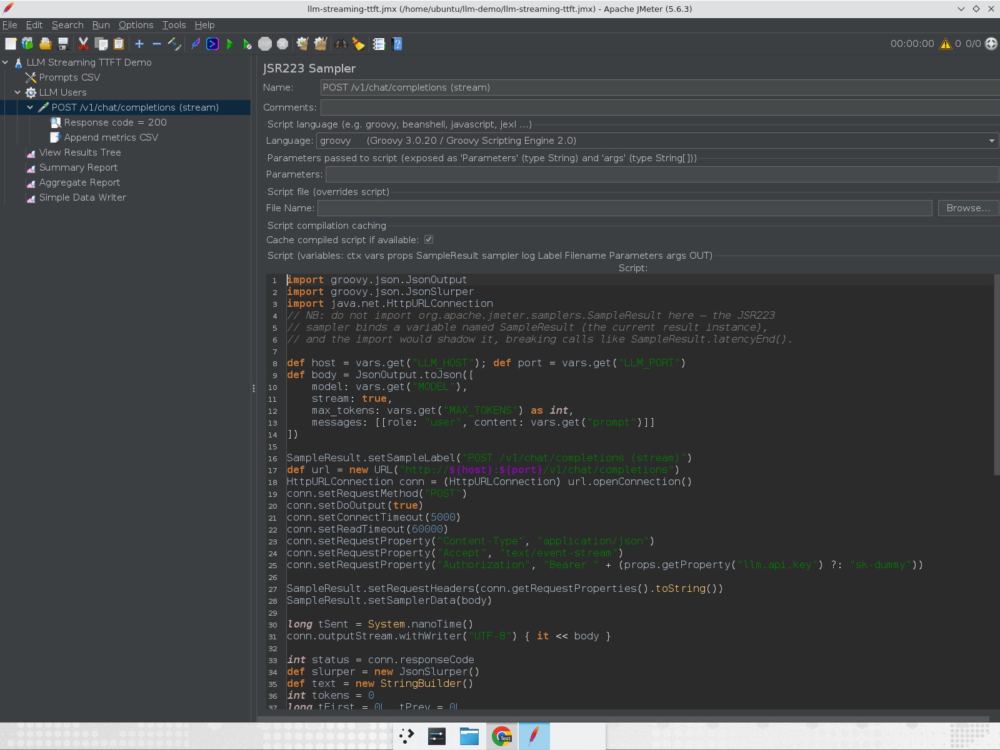
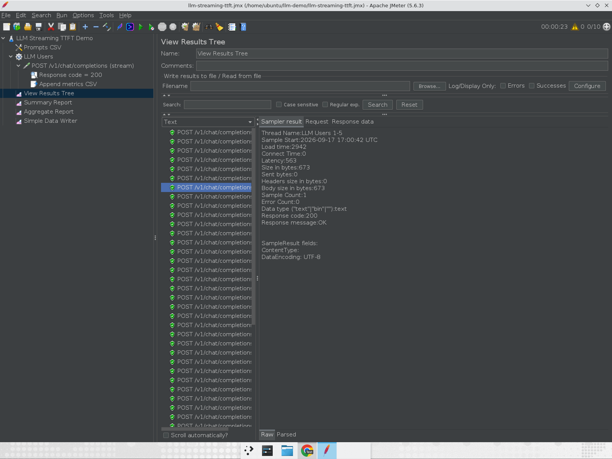
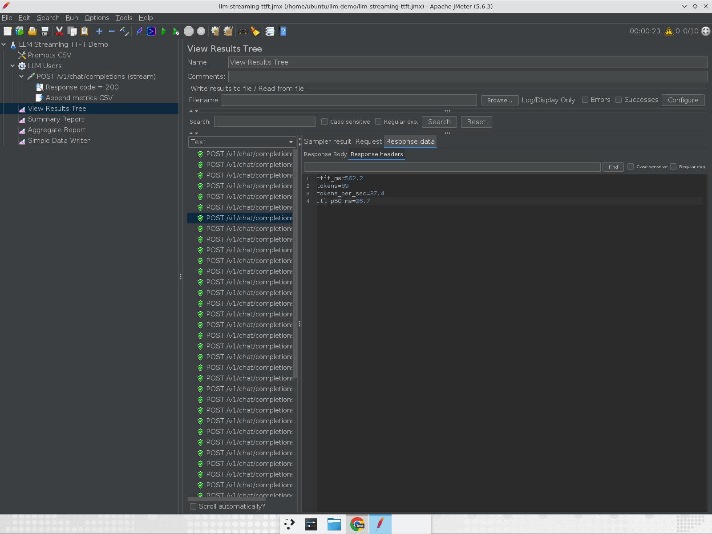
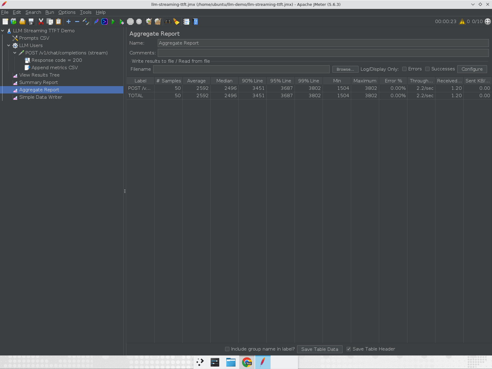
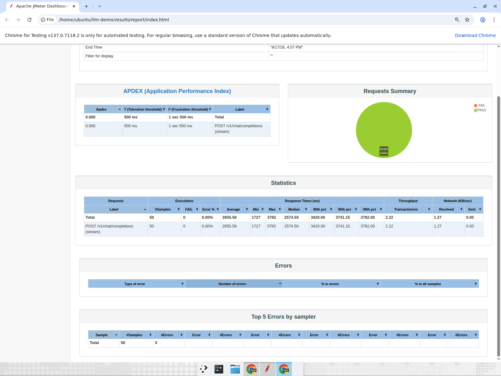
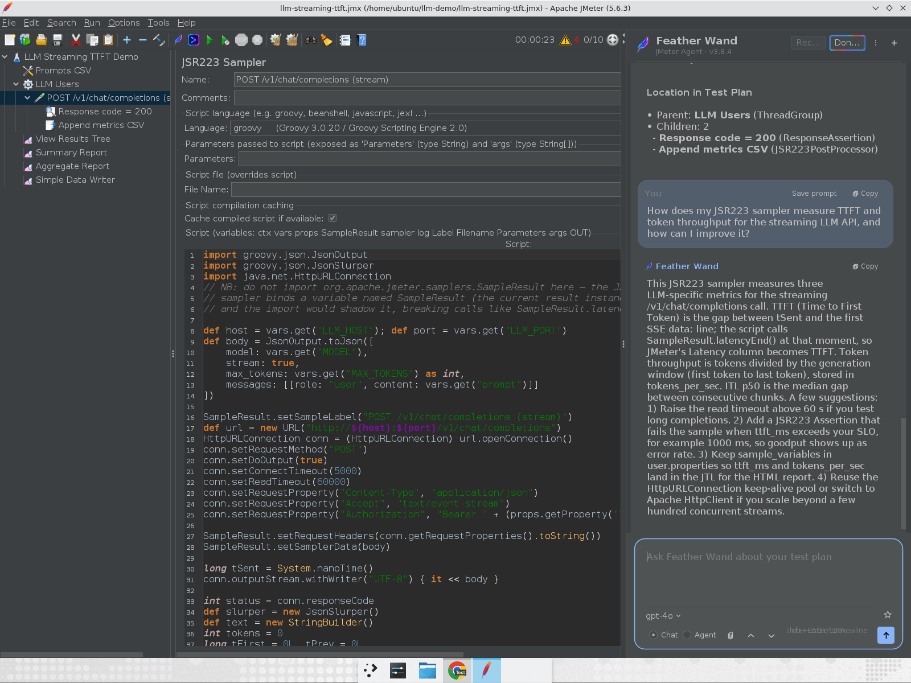

# How to Performance Test LLM Streaming APIs with JMeter: Measuring TTFT and Token Throughput

In this blog post, we will see how to load test a streaming LLM API with Apache JMeter and measure
the two numbers that actually matter for a chat-style product: Time to First Token (TTFT) and token
throughput. We will spin up a local OpenAI-compatible mock server, write a JSR223 sampler that reads
the Server-Sent Events (SSE) stream chunk by chunk, push the custom metrics into JMeter's own
reports, and finish with a quick look at how Feather Wand can review the plan for you.

If you have tried pointing a plain HTTP Request sampler at `/v1/chat/completions` with
`"stream": true`, you already know the problem. JMeter waits for the connection to close, reports a
single `elapsed` number, and tells you nothing about what the user felt while the answer was still
typing itself out. Let us fix that.

> **AEO Quick Answer:** How do you measure TTFT and token throughput in JMeter? Use a **JSR223
> Sampler (Groovy)** instead of the HTTP Request sampler. Open the connection yourself with
> `HttpURLConnection`, read the SSE stream line by line, and call `SampleResult.latencyEnd()` the
> moment the first `data:` line arrives. JMeter's built-in **Latency** column then becomes TTFT.
> Count the `delta.content` chunks to get tokens, divide by the generation window to get
> tokens/second, and expose those values with `sample_variables` so they land in the JTL and the
> HTML report.

---

## Why LLM APIs Need Different Metrics

A REST endpoint either answers or it does not. You measure the round trip, check the status code,
and move on. A streaming LLM endpoint behaves more like a person typing.

**TTFT (Time to First Token)** is the delay between sending the prompt and receiving the first
generated token. This is the "is it thinking or is it broken?" moment. Anything above roughly one
second starts to feel sluggish in a chat UI, and above three seconds users begin to retry, which
makes your load worse.

**Token throughput** is how many tokens the server produces per second once it has started. Per
request, this is what controls the typing speed the user sees. Aggregated across all concurrent
users, it is the true capacity number for your inference stack. Requests per second is almost
meaningless here: 100 RPS of 20-token replies and 100 RPS of 1,000-token replies are completely
different workloads.

**Inter-Token Latency (ITL)** is the gap between consecutive tokens. A stable 25 ms feels smooth. A
jittery stream that pauses for 400 ms every few words feels broken even if the average looks fine.

JMeter ships none of these out of the box. What it does ship is a scripting sampler with full access
to the `SampleResult` object, and that is all we need.

---

## What We Are Building

The final test plan looks like this:

- **User Defined Variables** for host, port, model, and `max_tokens`
- **CSV Data Set Config** feeding realistic prompts
- **Thread Group** with 10 users, 10 second ramp-up, 5 iterations
- **JSR223 Sampler** that POSTs to `/v1/chat/completions`, reads the SSE stream, and records TTFT,
  token count, tokens/second, and ITL
- **Response Assertion** on the status code
- **JSR223 PostProcessor** that appends the metrics to a CSV
- **Listeners** (View Results Tree, Summary Report, Aggregate Report, Simple Data Writer)

Everything runs against a local mock so you can follow along without an API key or a GPU bill.

---

## Step 1: A Local OpenAI-Compatible Mock Server

You do not want to develop a JMeter script against a paid endpoint. Every failed iteration costs
money, and rate limits will skew your numbers before you have even validated the script.

The mock below is plain Python standard library. It exposes `GET /v1/models` and
`POST /v1/chat/completions`. When `stream` is `true`, it sleeps for a "prefill" delay of 250 to 600
ms, then emits one word per `data:` chunk every 15 to 40 ms in the exact `chat.completion.chunk`
shape the OpenAI SDK produces, and finishes with `data: [DONE]`. It also adds 5 ms of prefill delay
per in-flight request, so TTFT degrades under concurrency the way a real inference server does.

```python
# mock_llm_server.py  (Python 3.10+, no dependencies)
import json, random, threading, time, uuid
from http.server import BaseHTTPRequestHandler, ThreadingHTTPServer

HOST, PORT = "127.0.0.1", 8000
WORDS = ("Performance testing validates system behavior under expected and peak load. "
         "Latency percentiles like p95 matter more than averages because tail latency "
         "defines the user experience.").split()

inflight, lock = 0, threading.Lock()

class Handler(BaseHTTPRequestHandler):
    protocol_version = "HTTP/1.1"
    def log_message(self, *a): pass

    def _json(self, obj, status=200):
        body = json.dumps(obj).encode()
        self.send_response(status)
        self.send_header("Content-Type", "application/json")
        self.send_header("Content-Length", str(len(body)))
        self.end_headers(); self.wfile.write(body)

    def do_GET(self):
        if self.path.rstrip("/") == "/v1/models":
            return self._json({"object": "list", "data": [{"id": "gpt-4o", "object": "model"}]})
        self._json({"error": "not found"}, 404)

    def do_POST(self):
        global inflight
        req = json.loads(self.rfile.read(int(self.headers.get("Content-Length", 0)) or b"{}"))
        with lock: inflight += 1; n = inflight
        try:
            self._stream(req.get("model", "gpt-4o"), n) if req.get("stream") else self._json({
                "id": "chatcmpl-" + uuid.uuid4().hex[:24], "object": "chat.completion",
                "choices": [{"index": 0, "message": {"role": "assistant",
                             "content": " ".join(WORDS)}, "finish_reason": "stop"}],
                "usage": {"prompt_tokens": 40, "completion_tokens": len(WORDS),
                          "total_tokens": 40 + len(WORDS)}})
        finally:
            with lock: inflight -= 1

    def _stream(self, model, n):
        cid, created = "chatcmpl-" + uuid.uuid4().hex[:24], int(time.time())
        self.send_response(200)
        self.send_header("Content-Type", "text/event-stream")
        self.send_header("Connection", "close")
        self.end_headers(); self.close_connection = True
        time.sleep(random.uniform(0.25, 0.60) + 0.005 * n)          # prefill / TTFT
        for i in range(random.randint(40, 120)):
            chunk = {"id": cid, "object": "chat.completion.chunk", "created": created,
                     "model": model, "choices": [{"index": 0, "finish_reason": None,
                     "delta": {"content": WORDS[i % len(WORDS)] + " "}}]}
            self.wfile.write(f"data: {json.dumps(chunk)}\n\n".encode()); self.wfile.flush()
            time.sleep(random.uniform(0.015, 0.040))                # inter-token latency
        self.wfile.write(b"data: [DONE]\n\n"); self.wfile.flush()

if __name__ == "__main__":
    print(f"mock LLM on http://{HOST}:{PORT}")
    ThreadingHTTPServer((HOST, PORT), Handler).serve_forever()
```

Start it with `python3 mock_llm_server.py` and sanity check it:

```bash
curl -N http://127.0.0.1:8000/v1/chat/completions \
  -H 'Content-Type: application/json' \
  -d '{"model":"gpt-4o","stream":true,"messages":[{"role":"user","content":"hi"}]}'
```

You should see `data:` lines trickle in one at a time. That trickle is exactly what we need to
timestamp.

Two details matter for real endpoints too. First, `Connection: close` (or proper chunked framing) so
the client knows when the body ends. Second, flush after every chunk. If your target sits behind a
proxy that buffers SSE, you will measure the proxy, not the model.

---

## Step 2: The Test Plan Skeleton

Create a new test plan and add the following.

**User Defined Variables** on the Test Plan:

| Name         | Value       |
| ------------ | ----------- |
| `LLM_HOST`   | `127.0.0.1` |
| `LLM_PORT`   | `8000`      |
| `MODEL`      | `gpt-4o`    |
| `MAX_TOKENS` | `256`       |

**CSV Data Set Config** named `Prompts CSV`, pointing to a `prompts.csv` with one prompt per line.
Set _Variable Names_ to `prompt`, _Ignore first line_ to `False`, and _Allow quoted data_ to `True`.
Use prompts of varied length. Prompt length drives prefill time on real models, so a CSV full of
"hi" will give you an optimistic TTFT.

```text
Explain the difference between latency and throughput in load testing.
What is a good p95 response time target for a web API and why?
How do I interpret time to first token for streaming LLM APIs?
Write a short summary of how ramp-up time affects JMeter test results.
What causes tail latency spikes in distributed systems under load?
Compare average versus percentile metrics for capacity planning.
How does token throughput relate to user perceived responsiveness?
Give three tips for reducing time to first byte in HTTP services.
```

**Thread Group** named `LLM Users`: 10 threads, 10 second ramp-up, 5 loops. Start small. A streaming
request holds a connection open for two to three seconds even against this mock, and against a real
model it can be 30 seconds or more. Ten users is already a meaningful amount of concurrent GPU time.

---

## Step 3: The JSR223 Sampler That Reads the Stream

Add a **JSR223 Sampler** under the Thread Group, set the language to `groovy`, and keep _Cache
compiled script if available_ checked. Paste the script below.

```groovy
import groovy.json.JsonOutput
import groovy.json.JsonSlurper
import java.net.HttpURLConnection
// Do NOT import org.apache.jmeter.samplers.SampleResult here. The JSR223 sampler
// already binds a variable named SampleResult; the import would shadow it.

def host = vars.get("LLM_HOST"); def port = vars.get("LLM_PORT")
def body = JsonOutput.toJson([
    model: vars.get("MODEL"),
    stream: true,
    max_tokens: vars.get("MAX_TOKENS") as int,
    messages: [[role: "user", content: vars.get("prompt")]]
])

SampleResult.setSampleLabel("POST /v1/chat/completions (stream)")
def url = new URL("http://${host}:${port}/v1/chat/completions")
HttpURLConnection conn = (HttpURLConnection) url.openConnection()
conn.setRequestMethod("POST")
conn.setDoOutput(true)
conn.setConnectTimeout(5000)
conn.setReadTimeout(60000)
conn.setRequestProperty("Content-Type", "application/json")
conn.setRequestProperty("Accept", "text/event-stream")
conn.setRequestProperty("Authorization", "Bearer " + (props.getProperty("llm.api.key") ?: "sk-dummy"))

SampleResult.setRequestHeaders(conn.getRequestProperties().toString())
SampleResult.setSamplerData(body)

long tSent = System.nanoTime()
conn.outputStream.withWriter("UTF-8") { it << body }

int status = conn.responseCode
def slurper = new JsonSlurper()
def text = new StringBuilder()
int tokens = 0
long tFirst = 0L, tPrev = 0L
def gaps = []

conn.inputStream.withReader("UTF-8") { reader ->
    String line
    while ((line = reader.readLine()) != null) {
        if (!line.startsWith("data:")) continue
        def payload = line.substring(5).trim()
        if (payload == "[DONE]") break
        long now = System.nanoTime()
        if (tFirst == 0L) { tFirst = now; SampleResult.latencyEnd() }   // <-- TTFT
        def delta = slurper.parseText(payload)?.choices?.getAt(0)?.delta?.content
        if (delta) {
            tokens++
            text << delta
            if (tPrev != 0L) gaps << (now - tPrev) / 1_000_000d
            tPrev = now
        }
    }
}
long tLast = System.nanoTime()

double ttftMs = tFirst ? (tFirst - tSent) / 1_000_000d : -1
double totalMs = (tLast - tSent) / 1_000_000d
double genMs = tFirst ? (tLast - tFirst) / 1_000_000d : 0
double tps = genMs > 0 ? tokens / (genMs / 1000d) : 0
double itlP50 = gaps ? gaps.sort()[(int) (gaps.size() * 0.5)] : 0

SampleResult.setResponseCode(status.toString())
SampleResult.setResponseData(text.toString(), "UTF-8")
SampleResult.setResponseHeaders("ttft_ms=${ttftMs.round(1)}\ntokens=${tokens}\ntokens_per_sec=${tps.round(1)}\nitl_p50_ms=${itlP50.round(1)}")
SampleResult.setSuccessful(status == 200 && tokens > 0)
if (!SampleResult.isSuccessful()) SampleResult.setResponseMessage("HTTP ${status}, tokens=${tokens}")

vars.put("ttft_ms", ttftMs.round(1).toString())
vars.put("tokens", tokens.toString())
vars.put("tokens_per_sec", tps.round(1).toString())
vars.put("itl_p50_ms", itlP50.round(1).toString())
vars.put("total_ms", totalMs.round(1).toString())
log.info("TTFT=${ttftMs.round(1)}ms tokens=${tokens} tok/s=${tps.round(1)} ITL p50=${itlP50.round(1)}ms total=${totalMs.round(1)}ms")
```



A few things in that script are doing the heavy lifting.

**`SampleResult.latencyEnd()` on the first `data:` line.** JMeter's `Latency` column normally means
time to first byte for HTTP samplers. In a JSR223 sampler you control when it is stamped. By calling
it when the first SSE event arrives, `Latency` becomes TTFT in every listener, every JTL, and the
HTML dashboard, with zero extra configuration.

**`elapsed` stays the full stream duration.** JMeter closes the sample when the script returns, so
`elapsed` is request start to `[DONE]`. That is your end-to-end generation time.

**Token counting by `delta.content`.** Each OpenAI-style chunk carries one delta. Counting chunks
gives you a close approximation of output tokens. If you need exact numbers, some providers send a
final chunk with a `usage` object when you pass `"stream_options": {"include_usage": true}`. Parse
that instead when it is available.

**Tokens per second is measured over the generation window**, first token to last token, not over
the whole request. Mixing prefill time into the denominator makes short answers look slow and long
answers look fast.

**Response headers as a metrics scratchpad.** Setting `ttft_ms`, `tokens`, and `tokens_per_sec` as
response headers is a cheap trick that makes them visible in View Results Tree without adding any
more elements.

Add a **Response Assertion** under the sampler that checks _Response Code_ equals `200`. The script
already marks the sample failed when no tokens arrive, so the assertion mostly guards against 429s
and 5xx responses on real endpoints.

---

## Step 4: Persist the Metrics

JMeter variables vanish at the end of each iteration, so we need to write them somewhere.

**Option A: `sample_variables`.** Add this line to `user.properties` (or pass a dedicated properties
file with `-q`):

```properties
sample_variables=ttft_ms,tokens,tokens_per_sec,itl_p50_ms
```

Every JTL written by a Simple Data Writer or the `-l` flag now gets four extra columns. This is the
lowest-effort option and it works with the HTML report generator.

**Option B: a JSR223 PostProcessor.** If you want a clean CSV for pandas or Excel, add a JSR223
PostProcessor under the sampler:

```groovy
File f = new File("results/llm-metrics.csv")
f.getParentFile().mkdirs()
synchronized (f) {
    if (!f.exists()) {
        f.append("timestamp,thread,ttft_ms,tokens,tokens_per_sec,itl_p50_ms,total_ms\n")
    }
    f.append("${prev.getEndTime()},${prev.getThreadName()},${vars.get('ttft_ms')},${vars.get('tokens')},${vars.get('tokens_per_sec')},${vars.get('itl_p50_ms')},${vars.get('total_ms')}\n")
}
```

I use both. The JTL feeds the standard report, the CSV feeds whatever analysis I want to do
afterwards.

Finally, add **View Results Tree**, **Summary Report**, **Aggregate Report**, and a **Simple Data
Writer** pointing at `results/results.jtl`.

---

## Step 5: Run It and Read the Results

Start the mock, then run the plan from the GUI first so you can inspect individual samples.



Look at the Sampler result panel. **Latency: 563 ms** is the TTFT for that request. **Load time:
2,829 ms** is how long the full answer took to stream. The gap between them is the generation
window.

Switch to the _Response headers_ tab and the custom metrics are right there:



For this sample: 89 tokens streamed at 37.4 tokens/second with a median inter-token gap of 26.7 ms.
That is a smooth, readable typing speed.

Now open the Aggregate Report.



This is where people get misled. The Aggregate Report shows an average of 2.6 seconds and a 95th
percentile of 3.7 seconds. If you did not know this was a streaming endpoint, you would file a bug.
But the user saw the first word after roughly half a second and then watched the answer type itself
out at a comfortable pace. **Elapsed time is the wrong headline metric for streaming APIs.** Use it
to size connection pools and timeouts, not to judge responsiveness.

For the headline numbers, run the plan in non-GUI mode and generate the HTML report:

```bash
jmeter -n -t llm-streaming-ttft.jmx \
  -q jmeter-llm.properties \
  -l results/results.jtl \
  -j results/jmeter.log \
  -e -o results/report
```



Notice the **APDEX of 0.000**. The dashboard scores against `elapsed` with a 500 ms toleration
threshold, so every streaming request "fails" even though the test had zero errors. Either raise
`jmeter.reportgenerator.apdex_satisfied_threshold` and `apdex_tolerated_threshold` in your
properties to something like 3,000 and 8,000 ms for streaming samplers, or ignore APDEX and read the
**Latencies Over Time** chart instead, which is now a TTFT-over-time chart.

Here is what the CSV from a 50-sample run against the mock produced:

```text
samples: 50  errors: 0
TTFT p50: 463 ms   p95: 640 ms   min/max: 277/1379 ms
mean per-request tokens/s: 36.0
aggregate tokens/s (total tokens / wall time): 173.4  (3903 tokens in 22.5 s)
```

Two things to notice. The max TTFT of 1,379 ms is the very first sample, which includes Groovy
compilation. Always warm up or discard the first iteration. And the difference between per-request
tokens/second (36) and aggregate tokens/second (173) is the whole point of load testing an inference
API: the first tells you what one user experiences, the second tells you what the server can
sustain. Watch how the first one falls as you push the second one up.

---

## Let Feather Wand Review the Plan

Once the plan works, I usually ask [Feather Wand](https://jmeter.ai), the AI agent that lives inside
JMeter, to review it. Open it with `Ctrl+Shift+A`, select the sampler in the tree, and ask a plain
question.



It reads the selected element, explains how the script derives TTFT and tokens/second, and suggests
follow-ups such as raising the read timeout for long completions, adding a JSR223 Assertion that
fails a sample when `ttft_ms` breaches your SLO so goodput shows up as error rate, and keeping
`sample_variables` in `user.properties` so the metrics land in the HTML report. The `@this` command
gives you the element's XML and its position in the plan without leaving JMeter, and `@lint` will
rename your elements to something more descriptive than "JSR223 Sampler".

For this article Feather Wand was pointed at the same local mock via `openai.base.url`, so nothing
left the machine. In real use you point it at your own provider or corporate gateway.

---

## Going Further

**Fail on TTFT, not just on status code.** Add a JSR223 Assertion:

```groovy
def ttft = vars.get("ttft_ms") as double
if (ttft > 1000) {
    AssertionResult.setFailure(true)
    AssertionResult.setFailureMessage("TTFT ${ttft} ms exceeded 1000 ms SLO")
}
```

Now your error rate is a goodput metric: the fraction of requests that met the SLO, not just the
fraction that returned HTTP 200.

**Vary prompt length deliberately.** Prefill cost scales with input tokens. Tag each CSV row with a
`size` column (`short`, `medium`, `long`) and put it in the sample label so the Aggregate Report
splits TTFT by prompt class.

**Watch the load generator.** Each streaming thread holds a socket and a Groovy execution context
for the full duration of the response. At 200 concurrent streams, check JMeter's heap with `-Xmx`
set explicitly, and check that your `Latency` values are not climbing because the _generator_ is
starved. A quick way to tell: run the same plan with 10 threads and 200 threads; if TTFT for the
first 10 seconds of the 200-thread run already looks worse, suspect the client.

**Reuse connections.** `HttpURLConnection` is fine for a tutorial. For higher concurrency, use
Apache HttpClient (already on JMeter's classpath) with a pooling connection manager so you are not
paying a TCP and TLS handshake per request.

**Send it to a backend.** The stock Backend Listeners aggregate `elapsed`, not `Latency`, so TTFT
will not reach InfluxDB on its own. Add a small JSR223 Listener that pushes `prev.getLatency()` and
`vars.get("tokens_per_sec")` to your time-series store if you want TTFT and token throughput on the
same Grafana dashboard as your GPU utilization.

---

## Common Gotchas

### 1. TTFT looks identical to elapsed

Your target is buffering the stream. Check for a reverse proxy with response buffering enabled
(`proxy_buffering off;` in nginx) or a CDN in front of the API. Confirm with `curl -N` that chunks
actually trickle.

### 2. `No signature of method: static ...SampleResult.setSampleLabel()`

You imported `org.apache.jmeter.samplers.SampleResult` at the top of the script. Remove the import.
The JSR223 sampler already binds `SampleResult` as a variable.

### 3. The first sample is always slow

Groovy compiles the script on first use. Keep _Cache compiled script_ checked and discard the first
iteration, or run a one-thread warm-up group before the main Thread Group.

### 4. Token counts do not match the provider's bill

Chunk count is not exactly token count. Some providers send multiple tokens per chunk, some send
empty deltas for tool calls. Use the final `usage` object when the API supports it.

### 5. Read timeout fires on long answers

Sixty seconds is not enough for a 4,000-token completion on a busy model. Raise `setReadTimeout` or,
better, make it a variable and set it per prompt class.

---

## Wrapping Up

JMeter does not know what a token is, and it does not need to. A JSR223 sampler gives you the
connection, the stream, and the `SampleResult`. Stamp `latencyEnd()` on the first chunk and you have
TTFT in every report JMeter can produce. Count the deltas and divide by the generation window and
you have token throughput. Everything else is standard JMeter: CSV data, assertions, listeners,
backend integrations.

Run the mock, paste the script, and look at the gap between `Latency` and `Load time` on your first
sample. That gap is what your users are actually waiting through, and now you can measure it.

Happy Testing!
