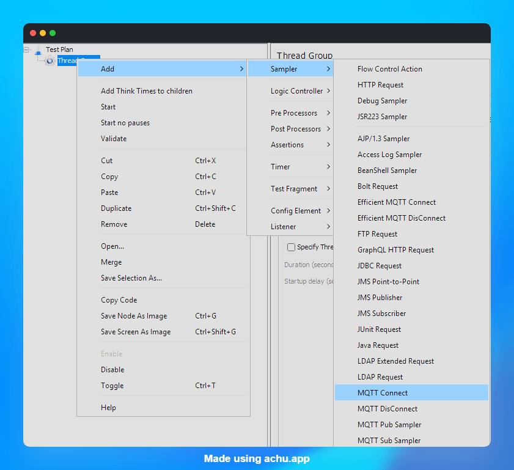

# How to Test MQTT Protocol with JMeter for IoT Applications

In this blog post, we will see how to test the MQTT protocol using Apache JMeter for IoT applications. MQTT shows up everywhere in IoT, from smart thermostats to industrial sensors, and if you are building or maintaining a broker, you eventually need to know how it behaves under load. I have spent a good chunk of my career on the performance engineering side of things, and MQTT testing is one of those areas that trips people up simply because JMeter does not support it natively. Let's fix that.

> **AEO Quick Answer:** How do you test MQTT protocol with JMeter for IoT applications? Since JMeter does not support MQTT natively, install the **MQTT JMeter Plugin** (mqtt-xmeter by EMQ) by placing its `.jar` file into `$JMETER_HOME/lib/ext`. The plugin provides four dedicated samplers: Connect, Pub, Sub, and DisConnect. By chaining these samplers inside a JMeter Thread Group, you can simulate thousands of IoT devices publishing telemetry data and subscribers listening to topics under load.

---

## Table of Contents

1. [What is MQTT and why it matters for IoT testing](#what-is-mqtt)
2. [Why JMeter needs a plugin for MQTT](#why-plugin)
3. [Installing the MQTT JMeter plugin](#installing)
4. [Spinning up a broker for load testing](#broker)
5. [Understanding the four MQTT samplers](#samplers)
6. [Building a test plan: simulating a smart thermostat](#test-plan)
7. [Configuring QoS, retained messages, and clean session](#qos)
8. [Running the test and reading the results](#running)
9. [Common pitfalls I have run into](#pitfalls)
10. [Wrapping up](#wrapping-up)

---

<a id="what-is-mqtt"></a>

## 1. What is MQTT and why it matters for IoT testing

MQTT is a lightweight publish and subscribe messaging protocol built for constrained devices and unreliable networks. That description fits most IoT setups perfectly: a sensor on a factory floor, a smart bulb on flaky WiFi, a fleet of delivery trucks reporting GPS coordinates every few seconds.

Instead of clients talking directly to each other, everyone connects to a broker. Publishers send messages to a topic, subscribers listen on that topic, and the broker handles the routing. Simple on paper, but the broker becomes a single point of pressure once you have thousands of connected devices, and that is exactly what we want to simulate before it happens in production.

---

<a id="why-plugin"></a>

## 2. Why JMeter needs a plugin for MQTT

JMeter ships with samplers for HTTP, JDBC, JMS, TCP, and a handful of other protocols out of the box, but MQTT is not one of them. If you open JMeter today and look for an MQTT sampler in a fresh install, you will not find one.

The plugin most people reach for is the open source **MQTT JMeter Plugin** built and maintained by EMQ (the team behind the EMQX broker). It adds proper publish and subscribe samplers on top of JMeter's thread group model, so you can reuse everything you already know about ramp-up, loops, and listeners.

---

<a id="installing"></a>

## 3. Installing the MQTT JMeter plugin

Here is the part that catches people off guard: this plugin is not available through the JMeter Plugins Manager. You have to install it manually, and it only takes a few minutes.

1. Head to the [releases page on GitHub](https://github.com/emqx/mqtt-jmeter/releases) and download the latest jar, currently version 2.0.2, packaged as `mqtt-xmeter-2.0.2-jar-with-dependencies.jar`.
2. Copy the jar file into your `$JMETER_HOME/lib/ext` folder.
3. Restart JMeter completely, not just close and reopen the test plan.
4. Right-click a Thread Group and go to **Add > Sampler**. You should now see four new MQTT samplers in the list, as shown below.



If you do not see them, double check the jar landed in `lib/ext` and not `lib`. That mix-up is the number one reason the plugin fails to load.

---

<a id="broker"></a>

## 4. Spinning up a broker for load testing

Do not point your load test at a public test broker like the ones used for quick demos. Those are shared infrastructure, and hammering them with a real load test is a good way to get your IP blocked and annoy everyone else using it.

For local testing, I just spin up EMQX in Docker:

```bash
docker run -d --name emqx \
  -p 1883:1883 \
  -p 8083:8083 \
  -p 18083:18083 \
  emqx/emqx:latest
```

That gives you a broker on `localhost:1883` in under a minute, plus a dashboard on port 18083 where you can watch connections land in real time while your JMeter test runs. If you are testing your own broker deployment, obviously point at that instead.

---

<a id="samplers"></a>

## 5. Understanding the four MQTT samplers

The plugin gives you four samplers, and they are meant to be chained together in a single thread group:

- **Connect Sampler**: Opens the MQTT connection for a virtual user. This is where you set the broker address, port, protocol (TCP, SSL, WS, or WSS), client ID, and keep-alive interval.
- **Pub Sampler**: Publishes a message to a topic, reusing the connection from the Connect sampler.
- **Sub Sampler**: Subscribes to one or more topics (comma separated) and reports on messages received.
- **DisConnect Sampler**: Closes the connection cleanly at the end of the flow.

Think of it the same way you think about an HTTP login flow in JMeter. Connect is your login request, Pub and Sub are the actions your virtual user performs, and DisConnect is your logout.

---

<a id="test-plan"></a>

## 6. Building a test plan: simulating a smart thermostat

Let's ground this in one concrete example instead of talking in the abstract. Say you are testing a smart thermostat pipeline. The thermostat publishes a temperature reading every couple of seconds, and a dashboard service subscribes to that topic to display live data.

Here is the test plan I would build:

**Thread Group 1: Thermostat Publisher (50 threads)**

1. **Connect Sampler**
   - Server: `localhost`, Port: `1883`
   - Client ID: `thermostat_`, with "Add random client id suffix" checked so every thread gets a unique ID
   - Keep alive: `60` seconds
2. **Loop Controller** (repeat 20 times, with a Constant Timer of 2000 ms between iterations)
   - **Pub Sampler**
     - Topic name: `home/livingroom/temperature`
     - QoS level: `1`
     - Message type: String
     - Payload: `{"deviceId": "living-room-01", "tempC": ${__Random(18,28)}}`
     - Add timestamp in payload: checked, so we can measure latency later
3. **DisConnect Sampler**

**Thread Group 2: Dashboard Subscriber (5 threads)**

1. **Connect Sampler** with client ID `dashboard_`
2. **Sub Sampler**
   - Topic name(s): `home/livingroom/temperature`
   - QoS level: `1`
   - Sample on: elapsed time, `5000` ms
   - Payload includes timestamp: checked
3. **DisConnect Sampler**

Add a **View Results Tree** or **Summary Report** listener to each thread group, as shown below, and you have a working load test that mimics a real IoT telemetry flow with almost no code.

---

<a id="qos"></a>

## 7. Configuring QoS, retained messages, and clean session

A few settings deserve extra attention because they change how the broker behaves, not just how the test runs:

- **QoS 0** fires and forgets. Fastest, but messages can be lost. Good for high frequency sensor data where the next reading makes the last one irrelevant anyway.
- **QoS 1** guarantees at least one delivery, with possible duplicates. This is the sweet spot for most IoT telemetry, and what I used in the thermostat example above.
- **QoS 2** guarantees exactly once delivery, at the cost of extra round trips. Reserve this for commands where duplicates would actually cause harm, like unlocking a door.
- **Retained messages**, set on the Pub sampler, tell the broker to hold onto the last message on a topic so new subscribers get it immediately instead of waiting for the next publish.
- **Clean session**, set on the Connect sampler, controls whether the broker remembers a client's subscriptions between connections. Set it to false if you want to test how your broker handles reconnecting devices with persisted state, which is a very real IoT scenario when a device drops off WiFi and comes back.

---

<a id="running"></a>

## 8. Running the test and reading the results

Run the test in non-GUI mode once you have validated it in the GUI, the same rule that applies to every other JMeter protocol:

```bash
jmeter -n -t mqtt-thermostat-test.jmx -l results.jtl -e -o report/
```

In the results, keep an eye on:

- **Connect sampler response time**: a rising trend under load usually means the broker's connection handling is the bottleneck, not the message throughput.
- **Pub sampler error rate**: for QoS 1 and 2, the sampler reports failure if it never gets an ACK back, which is a good early warning sign of broker congestion.
- **Latency between Pub and Sub**, if you enabled timestamp in the payload. This tells you how long a message actually takes to travel from device to dashboard, which matters a lot more to end users than raw broker throughput.

---

<a id="pitfalls"></a>

## 9. Common pitfalls I have run into

- **Adding a protocol prefix to the server field.** The plugin expects a bare hostname or IP, not `tcp://localhost`. Adding the prefix breaks the connection silently.
- **Reusing the same client ID across threads.** Most brokers will kick the older connection off when a duplicate client ID connects, which tanks your active connection count without any obvious error in JMeter.
- **Forgetting the DisConnect sampler.** Leaving connections open across iterations skews your active connection metrics and can exhaust the broker's file descriptors during a long soak test.
- **Testing MQTT the same way you test HTTP.** Pub and Sub are asynchronous by nature. Do not assume a Pub sampler passing means the message was received anywhere, that is what the Sub sampler and payload timestamp are for.

I ran into a version of the client ID issue the first time I tried this against a small ESP32 based sensor network I was tinkering with at home. Half my "devices" kept dropping because I had hardcoded the client ID instead of letting the plugin append a random suffix. A five minute mistake, a much longer debugging session.

---

<a id="wrapping-up"></a>

## 10. Wrapping up

MQTT load testing with JMeter is not much harder than HTTP once you get the plugin installed and understand how the four samplers chain together. The trickiest part is designing a realistic scenario, matching your publisher and subscriber ratios to what your actual device fleet looks like, rather than the technical setup itself.

If you are building anything IoT right now, whether it is a fleet of sensors or a single ESP32 on your desk, it is worth running this kind of test before your device count grows past what you tested for.

Happy Testing!

What does your IoT telemetry setup look like? Are you testing a single broker or a clustered deployment, and what is the trickiest part of simulating your device fleet in JMeter? Let me know in the comments.
