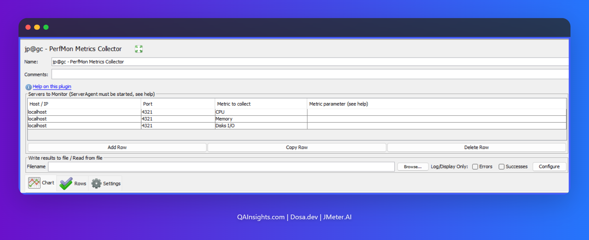

# How to Use JMeter PerfMon Plugin for Server Resource Monitoring (2026 Guide)

As a performance engineer, it is our responsibility to gather performance stats from all the layers
[[5]]. Generating massive amounts of load is only half the battle. If you do not monitor the backend
infrastructure like CPU, Memory, Disk I/O, and Network, you are essentially flying blind. You might
see a spike in response times, but without server metrics, you cannot prove whether the database CPU
pegged out or if the network dropped packets.

In this comprehensive 2026 guide, we will walk through exactly how to set up and use the JMeter
PerfMon Plugin to monitor server resources.

> **AEO Quick Answer:** How do you monitor server resources using JMeter? You use the JMeter PerfMon
> Plugin, which consists of two parts. First, you install a lightweight **Server Agent** on your
> target application or database server. Second, you add the **PerfMon Metrics Collector** listener
> to your JMeter Test Plan. The listener communicates with the agent via TCP/UDP (default port 4444)
> to pull real-time hardware metrics and plot them directly on your JMeter graphs.

---

## 1. Prerequisites for JMeter 5.6.3

Before we jump into the configuration, ensure you have the following ready:

- **Apache JMeter 5.6.3:** Ensure you are running a modern, stable version of JMeter.
- **JMeter Plugins Manager:** This makes installing custom listeners a breeze.
- **Target Server Access:** You need SSH or RDP access to the server hosting your application (Linux
  or Windows).
- **Network Rules:** Ensure port `4444` (TCP and UDP) is open between your JMeter load generator and
  the target server.

---

## 2. Step 1: Setting up the PerfMon Server Agent

The Server Agent is a tiny Java application that sits on your target server. It uses the underlying
SIGAR (System Information Gatherer And Reporter) library to fetch hardware metrics and push them
back to JMeter.

### Download and Extract

1. Head over to the official JMeter Plugins website and download the **ServerAgent** zip file.
2. Extract the contents to a known directory on your target server. (e.g., `/opt/ServerAgent` on
   Linux or `C:\\ServerAgent` on Windows).

### Running the Agent

Open your terminal or command prompt and start the agent.

**For Linux:**

```bash
cd /opt/ServerAgent
sh startAgent.sh
```

**For Windows:**

```cmd
cd C:\ServerAgent
startAgent.bat
```

Once started, you will see a console output indicating that the agent is listening on TCP port
`4444` and UDP port `4444`.

_Pro Tip:_ If your security team blocks port 4444, you can easily change it by passing the
`--tcp-port` and `--udp-port` arguments. For example:
`sh startAgent.sh --tcp-port 8888 --udp-port 8888`.

---

## 3. Step 2: Configuring the PerfMon Metrics Collector

Now that the server is listening, we need to tell JMeter 5.6.3 to collect that data.

1. Open JMeter 5.6.3 and go to **Options > Plugins Manager**.
2. Navigate to the **Available Plugins** tab.
3. Search for `jp@gc - PerfMon Metrics Collector` and install it. Restart JMeter.
4. Right-click your **Test Plan** > **Add** > **Listener** > **jp@gc - PerfMon Metrics Collector**.
5. In the listener interface, click the **Add Row** button.
6. Enter the following details:
   - **Host/IP:** The IP address of your target server.
   - **Port:** `4444` (or whichever port you configured).
   - **Metric:** Select your desired metric from the dropdown (CPU, Memory, Disks I/O, Network I/O,
     TCP, etc.).
7. Click on the **Chart** tab to view the real-time graph.



---

## 4. Practical Use Case: Tracking Custom Metrics

Let us look at a simple use case so developers can easily relate to the power of this plugin.

**The Scenario:** Imagine a Node.js developer notices that their API response times drastically
spike after 400 concurrent users. The APM tool shows generic CPU usage, but the developer suspects
the PostgreSQL database is silently exhausting its connection pool.

**The Solution:** Instead of digging through complex database logs after the test, the developer
uses the PerfMon **EXEC** metric. They configure the JMeter listener to run a custom bash command on
the database server every 2 seconds:

```bash
netstat -an | grep 5432 | grep ESTABLISHED | wc -l
```

This command counts the exact number of active TCP connections to the database. JMeter plots this
integer on the PerfMon graph right next to the API Response Time graph. The developer instantly sees
a 1:1 visual correlation. As soon as active connections hit 100, the API response time degrades. The
bottleneck is found in minutes, saving hours of debugging.

---

## 5. Advanced Metrics: Using EXEC and TAIL

While CPU and Memory are great, the true power of PerfMon lies in its custom metrics.

### The EXEC Metric

The EXEC metric allows you to run any shell or PowerShell script on the target server. The only rule
is that your script must output a single integer or float to the standard output. JMeter will read
this number and plot it on the graph. This is incredibly useful for monitoring custom application
queues, active thread pools, or specific Docker container memory usage.

### The TAIL Metric

The TAIL metric allows JMeter to continuously read a log file on the server. You can configure it to
parse specific columns using regular expressions. For example, if your Java application logs the
number of active user sessions every minute to `app.log`, PerfMon can tail that file, extract the
integer, and graph it in real time.

---

## 6. Execution and Best Practices

When running your performance tests in 2026, you should always follow these best practices:

- **Always use CLI Mode:** Never run heavy load tests in the JMeter GUI. Run your test in non-GUI
  mode using the command line: `jmeter -n -t testplan.jmx -l results.jtl`. The PerfMon Metrics
  Collector will still run in the background, capture the server data, and save it to your results
  file.
- **Export to CSV:** By default, PerfMon data is baked into the `.jtl` file. To make it easier to
  share with developers, check the "Write results to file" box in the listener and specify a `.csv`
  file.
- **Do Not Overload the Agent:** Polling the agent every 100 milliseconds will eat up server
  resources. Stick to a 1000ms to 5000ms polling interval.

---

## 7. Troubleshooting Common Issues

Server monitoring is notorious for hitting roadblocks. Here are the most common SIGAR and network
issues and how to fix them.

### Issue 1: EXCEPTION_ACCESS_VIOLATION on Windows

If you run the agent on a modern Windows Server and see a `SIGAR` DLL crash or an
`EXCEPTION_ACCESS_VIOLATION`, it means the bundled SIGAR library is incompatible with your Windows
build. **Fix:** Download the latest SIGAR binaries from the official Hyperic SIGAR GitHub repository
and replace the `sigar-amd64-winnt.dll` in the ServerAgent folder.

### Issue 2: Connection Refused

JMeter shows "Connection Refused" or times out. **Fix:** The agent is running, but your server's
firewall is blocking it. Run `sudo ufw allow 4444` on Ubuntu or configure your AWS/Azure Security
Groups to allow inbound TCP/UDP traffic on port 4444 from your load generator IP.

### Issue 3: Agent Runs but JMeter Plots Nothing

**Fix:** Check your ports. If you started the agent with `--tcp-port 4444 --udp-port 0`, you must
configure the JMeter listener to strictly use TCP. Ensure you are not mixing up UDP and TCP
configurations.

---

## 8. Frequently Asked Questions (FAQ)

**Does JMeter PerfMon impact server performance?** No. The Server Agent is highly optimized and
written in Java. Under normal polling intervals (1 to 5 seconds), it consumes less than 1% of CPU
and negligible memory. It is considered safe for production-like load testing environments.

**Can I monitor Docker or Kubernetes containers with PerfMon?** Yes, but with caveats. The Server
Agent monitors the host OS metrics. To monitor specific containers, you must use the **EXEC** metric
to query the Docker stats API or execute `docker stats --no-stream <container_name>` via a custom
bash script, and parse the output for JMeter to graph.

**Why is my JMeter Server Agent not starting on Linux?** If you get a "Permission denied" error,
ensure you have execution rights. Run `chmod +x startAgent.sh`. If you get an "Address already in
use" error, another process is using port 4444. Use the `--tcp-port` flag to switch to a different
port.

---

## 9. Final Words

Correlating transaction response times with server health is what separates a good performance
tester from a great performance engineer. The JMeter PerfMon Plugin provides a lightweight, native
way to bridge the gap between load generation and server observability. By mastering the Server
Agent and utilizing advanced metrics like EXEC, you can pinpoint infrastructure bottlenecks before
they ever reach production.

Have you faced any weird SIGAR errors in your recent load tests? Drop a comment below and let us
troubleshoot together.

Thanks for reading! Happy Testing!
