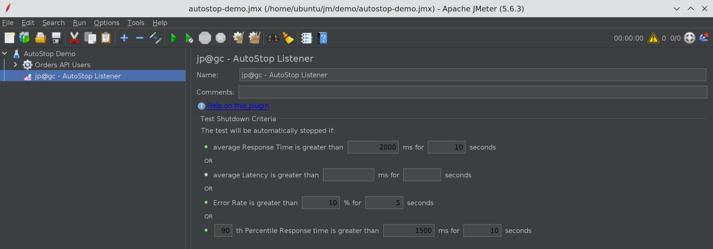
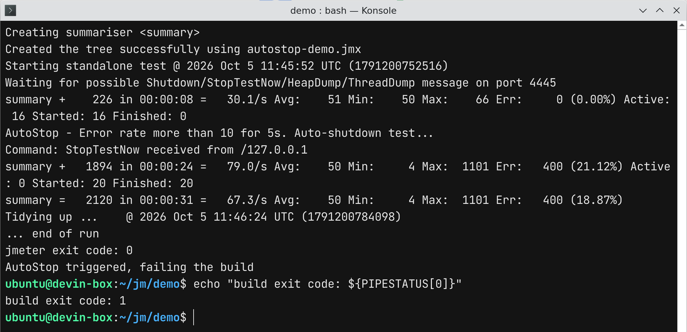

# JMeter AutoStop Listener: How to Stop Load Tests Automatically on SLA Breach

In this blog post, we will see how the JMeter AutoStop Listener plugin stops a load test on its own
when error rate, response time, or a response time percentile crosses your SLA. I will also show the
one thing most people miss when they drop it into a pipeline: JMeter still exits with code `0` after
AutoStop kills the test, so your CI job stays green unless you handle it yourself.

Every performance engineer has been there. You kick off a 60-minute soak test at 6 PM, the
application falls over at minute 4, and JMeter keeps hammering a dead service for the next 56
minutes. You get a huge JTL full of `503` responses, wasted load generator hours, and sometimes an
angry message from the team that owns the downstream system. AutoStop exists to end that run at
minute 4.

Everything below was verified on JMeter 5.6.3 with AutoStop 0.3, which is the latest version
published to the Plugins Manager repository.

## 1. What is the JMeter AutoStop Listener?

AutoStop is a jp@gc plugin from jmeter-plugins.org (plugin ID `jpgc-autostop`, class
`kg.apc.jmeter.reporters.AutoStop`). It is a listener, so it sees every sample result, and it checks
runtime KPIs against thresholds you define. When one of them is breached for long enough, it asks
JMeter to stop the test.

On PerfAtlas it is part of both the CI/CD Stack and the Load Shaping Stack collections, and the
[AutoStop Listener plugin page](/plugin/jpgc-autostop/) shows around 2,600 downloads. It is small
and old, but it solves a problem every team running unattended tests has.

Version 0.3 gives you four criteria:

| Criterion               | Threshold unit | What it compares                                    |
| :---------------------- | :------------- | :-------------------------------------------------- |
| Average Response Time   | ms             | Average elapsed time of samples in each second      |
| Average Latency         | ms             | Average latency (time to first byte) in each second |
| Error Rate              | %              | Percentage of failed samples in each second         |
| Nth Percentile Response | ms             | Percentile of response time, e.g. 90 for P90        |

Each criterion has a second field: the number of seconds the threshold must be exceeded
_sequentially_ before the test stops. The criteria are combined with OR logic, so the first one to
fire stops the test. Leave a field empty or set it to `0` to disable that criterion.

> The [official AutoStop wiki](https://jmeter-plugins.org/wiki/AutoStop/) now lists six criteria,
> including relative window percentile degradation and error count. Those two exist in the
> [plugin source on GitHub](https://github.com/undera/jmeter-plugins/tree/master/plugins/autostop)
> but are not in 0.3, the version you get from the Plugins Manager today. If you do not see them in
> the GUI, that is why.

## 2. Installing the AutoStop Listener

The easiest way is the Plugins Manager. Open **Options > Plugins Manager > Available Plugins**,
search for `AutoStop`, tick **AutoStop Listener**, and click **Apply Changes and Restart JMeter**.
If you do not have the Plugins Manager yet, follow
[How to install JMeter Plugins Manager](/blog/how-to-install-jmeter-plugins-manger/) first.

For headless machines and Docker images, use the command line installer:

```bash
$JMETER_HOME/bin/PluginsManagerCMD.sh install jpgc-autostop
```

The full Docker flow is in my
[PluginsManagerCMD in Docker](/blog/jmeter-plugin-install-automation-pluginsmanagercmd-docker/)
post. If you install manually, AutoStop 0.3 needs two JARs: `jmeter-plugins-autostop-0.3.jar` in
`lib/ext` and its dependency `jmeter-plugins-cmn-jmeter-0.8.jar` in `lib`.

## 3. The demo setup

To show real behavior instead of theory, I used a tiny Python server on `127.0.0.1:8081` that
responds `200` in about 50 ms for the first 30 seconds, then switches to `503 Service Unavailable`
for every request. That is a simple way to simulate a service that falls over mid-test.

The test plan is minimal:

- **Thread Group** "Orders API Users": 20 threads, 10 second ramp-up, infinite loop, duration 600
  seconds
- **HTTP Request** `GET /api/orders`
- **Constant Timer** of 200 ms think time
- **jp@gc - AutoStop Listener** at the Test Plan level

Without AutoStop, this test would run for 10 minutes no matter what. With it, it should end shortly
after the server starts failing.

## 4. Configuring the AutoStop Listener

Add it via **Test Plan > Add > Listener > jp@gc - AutoStop Listener**. Put it at the Test Plan level
so it sees samples from every thread group. If you put it under one thread group, it only evaluates
that thread group's samples.

Here is the configuration I used:

- Average Response Time greater than `2000` ms for `10` seconds
- Average Latency left empty (disabled)
- Error Rate greater than `10` % for `5` seconds
- `90`th Percentile Response time greater than `1500` ms for `10` seconds



The same configuration in the JMX looks like this, which is handy if you generate or patch test
plans in a pipeline:

```xml
<kg.apc.jmeter.reporters.AutoStop guiclass="kg.apc.jmeter.reporters.AutoStopGui"
    testclass="kg.apc.jmeter.reporters.AutoStop" testname="jp@gc - AutoStop Listener">
  <stringProp name="avg_response_time">2000</stringProp>
  <stringProp name="avg_response_time_length">10</stringProp>
  <stringProp name="avg_response_latency">0</stringProp>
  <stringProp name="avg_response_latency_length">0</stringProp>
  <stringProp name="error_rate">10</stringProp>
  <stringProp name="error_rate_length">5</stringProp>
  <stringProp name="percentile_response_time">1500</stringProp>
  <stringProp name="percentile_response_time_secs">10</stringProp>
  <stringProp name="percentile_value">90</stringProp>
</kg.apc.jmeter.reporters.AutoStop>
```

Because these are plain string properties, you can parameterize them with JMeter properties, for
example `${__P(autostop.error_rate,10)}`, and pass different thresholds per environment with
`-Jautostop.error_rate=5`. I tested this on 5.6.3 and AutoStop picked up the value at test start.

## 5. How the thresholds are actually evaluated

This is the part worth understanding before you trust AutoStop with a release gate. I read the
plugin source and confirmed it against the 0.3 bytecode.

**Average response time, latency, and error rate are per-second values, not cumulative.** AutoStop
collects samples into one-second buckets. At every second boundary it compares the previous bucket's
average against your threshold. If the bucket is under the threshold, the "exceeded since" timestamp
resets. The test only stops when the threshold has been exceeded for N consecutive seconds.

So with `10 %` for `5` seconds:

- One bad second at 40% errors followed by a clean second does nothing
- Five seconds in a row at 12% errors stops the test
- A test that averages 8% errors overall but has a sustained 6-second burst of 30% errors also stops

This is exactly what you want for a guard rail. Short blips do not kill a long run, sustained
failures do.

**The percentile criterion is different.** It is calculated over the whole test so far, not per
window. On top of that, it only adds one sample per second (the sample that crosses the second
boundary) to the percentile calculator. In practice this means the P90 that AutoStop sees is a
sampled, cumulative P90 that moves slowly. It is fine for catching a test that has been bad for a
while, but it will react much later than the per-second criteria. If you need a fast reaction, rely
on average response time or error rate and use the percentile as a secondary check.

## 6. Running the test in non-GUI mode

Here is the run against the flaky server:

```bash
jmeter -n -t autostop-demo.jmx -l results.jtl -j jmeter.log
```



The numbers from that run:

| Metric              | Value                      |
| :------------------ | :------------------------- |
| Planned duration    | 600 seconds                |
| Actual duration     | about 32 seconds           |
| First failed sample | 26.7 seconds into the test |
| Last sample         | 31.2 seconds into the test |
| Total samples       | 2,120                      |
| Failed samples      | 400 (18.87%)               |

The first errors appeared at 26.7 seconds and the last sample was recorded at 31.2 seconds, so
AutoStop ended the test about 4.5 seconds after the server started failing. That matches the `5`
second window, give or take the one-second bucket boundaries. A 10-minute test turned into a
32-second test, and the JTL contains 400 failures instead of tens of thousands.

In `jmeter.log` you will see:

```text
INFO k.a.j.r.AutoStop: Error rate more than 10 for 5s. Auto-shutdown test...
INFO k.a.j.r.AutoStop: Stopping JMeter via UDP call
INFO k.a.j.r.AutoStop: Sending StopTestNow request to port 4445
```

Two details here matter.

First, in non-GUI mode AutoStop sends `StopTestNow` over UDP to `localhost` on the port defined by
`jmeterengine.nongui.port` (default `4445`). This is the same mechanism as the `stoptest.sh` script.
It is not a graceful shutdown, so in-flight samples are interrupted. If you have changed that
property or blocked local UDP, AutoStop will log the attempt but the test will keep running.

Second, in GUI mode the behavior is different. The first five attempts ask threads to stop
gracefully (like **Run > Shutdown**), attempts six to ten call stop, and after ten it forces an
immediate stop. The wiki describes this escalation, but it only applies to the GUI.

## 7. The CI/CD gotcha: exit code 0

Look at the screenshot again. JMeter printed `jmeter exit code: 0`. AutoStop stopped the test
because the error rate breached the SLA, and JMeter still reported success.

That is because AutoStop just stops the engine. It does not change the process exit status. It does
set `auto_stopped=true`, but as a Java system property inside the JMeter JVM, so your shell or CI
runner cannot read it after JMeter exits. The wiki calls it an environment variable, but in the code
it is `System.setProperty("auto_stopped", "true")`.

The reliable approach is to check the log. AutoStop always logs `Auto-shutdown test...` when it
fires, so a short wrapper script is enough:

```bash
#!/usr/bin/env bash
set -uo pipefail

rm -f results.jtl jmeter.log
jmeter -n -t autostop-demo.jmx -l results.jtl -j jmeter.log
status=$?
echo "jmeter exit code: ${status}"

if grep -q "Auto-shutdown test" jmeter.log; then
  echo "AutoStop triggered, failing the build"
  exit 1
fi
exit "${status}"
```

With this wrapper, the run above returned `1` and the pipeline failed as it should. In GitHub
Actions, Jenkins, or GitLab CI, call this script as the test step and keep `results.jtl` and
`jmeter.log` as artifacts so you can see why it stopped.

If you also want the HTML dashboard for the partial run, generate it afterwards with
`jmeter -g results.jtl -o report/` before the script exits. The dashboard is still useful, it just
covers 32 seconds instead of 10 minutes.

## 8. Practical tips and pitfalls

A few things I recommend after running this:

- **Set unused fields to `0`, not empty.** With empty latency fields, 0.3 logs
  `ERROR k.a.j.r.AutoStop: Wrong response time:` with a `NumberFormatException` stack trace at test
  start. Setting them to `0` removes those. One `Wrong time period:` error remains in 0.3 because of
  an internal property that the GUI does not expose; it is harmless.
- **Watch out for ramp-up.** AutoStop starts evaluating from the first sample. If your application
  is slow while caches warm up, a tight response time threshold can stop the test in the first
  minute. Use a longer duration window, for example `60` seconds, or a looser threshold.
- **Keep it at the Test Plan level** unless you deliberately want to guard only one thread group.
- **Combine it with load shaping.** With the Throughput Shaping Timer and Concurrency Thread Group
  feeding more threads as response times grow, a failing system can attract a lot of threads
  quickly. AutoStop is the safety net for that setup. See
  [Throughput Shaping Timer vs Concurrency Thread Group](/blog/jmeter-throughput-shaping-timer-vs-concurrency-thread-group/)
  for how that feedback loop works.
- **It is a guard rail, not a pass/fail report.** AutoStop answers "should this run continue?". You
  still need a proper SLA check on the final results, for example in your dashboard or a results
  parser. For live visibility while the test runs, pair it with
  [Prometheus and Grafana via the Backend Listener](/blog/real-time-jmeter-metrics-with-prometheus-and-grafana-using-the-backend-listener/).

## 9. Suggested starting thresholds

These are reasonable starting points. Tune them per application once you have a baseline:

| Test type          | Error rate    | Average response time | Percentile           |
| :----------------- | :------------ | :-------------------- | :------------------- |
| CI smoke load test | 5 % for 10 s  | 2x SLA for 15 s       | Disabled             |
| Load test          | 10 % for 30 s | 3x SLA for 60 s       | P95 at 2x SLA, 120 s |
| Soak test          | 5 % for 60 s  | 3x SLA for 120 s      | P95 at 2x SLA, 300 s |
| Stress test        | 50 % for 30 s | Disabled              | Disabled             |

For a stress test you expect degradation, so the only job of AutoStop there is to stop beating a
system that is clearly down.

## Conclusion

The JMeter AutoStop Listener is the cheapest insurance you can add to an unattended load test.
Configure an error rate and an average response time threshold with a sensible duration window, keep
the percentile as a slower secondary check, and remember that per-second criteria react in seconds
while the percentile reacts in minutes. Most importantly, do not trust the JMeter exit code in CI.
Grep `jmeter.log` for `Auto-shutdown test` and fail the build yourself.

You can find download trends, versions, and the install ID on the
[AutoStop Listener page](/plugin/jpgc-autostop/) on PerfAtlas.

Happy Testing!
