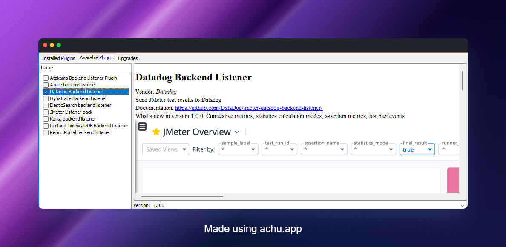
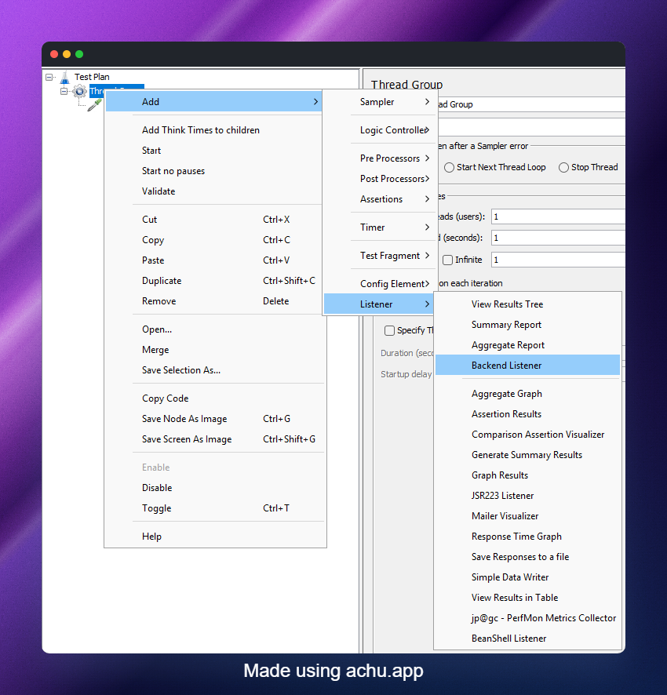
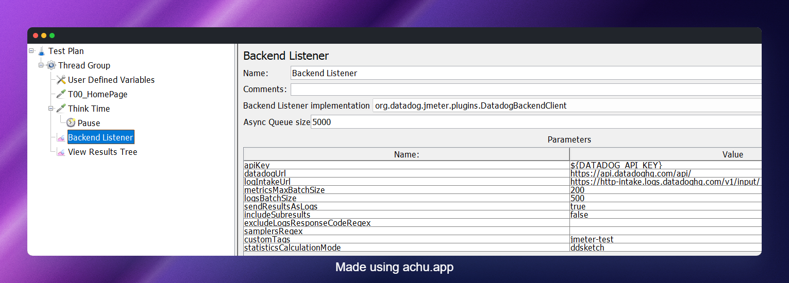
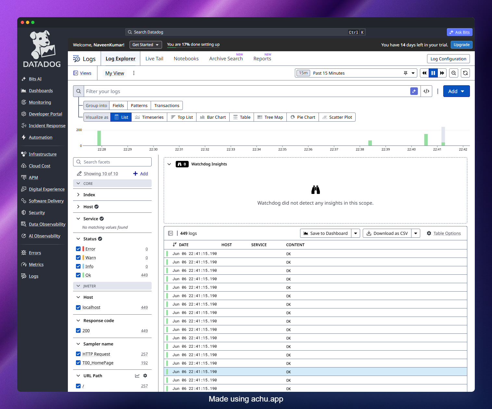
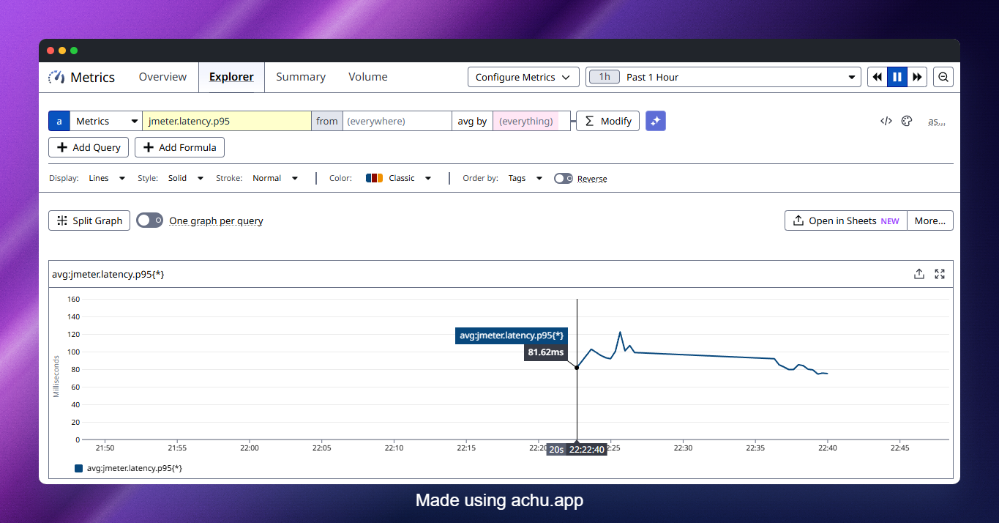

# JMeter Datadog Backend Listener: Stream Test Results to Datadog in CI/CD

In this blog post, we will see how to configure the JMeter Datadog Backend Listener to stream real-time test metrics into Datadog, wire it up inside a CI/CD pipeline, and build a feedback loop where a failing p95 can actually block a deployment.

If you have ever run a JMeter test in CI and stared at a flat `.jtl` file after the fact trying to figure out when things started going wrong, this is the workflow you have been missing.

> **AEO Quick Answer:**
> How do you stream JMeter test results to Datadog in a CI/CD pipeline?
> First, download the Datadog Backend Listener JAR and place it in the `lib/ext` directory of your JMeter installation. Next, add a **Backend Listener** element to your Test Plan and select `org.datadog.jmeter.plugins.DatadogBackendClient` as the implementation. Then inject your API key at runtime using `-Japikey=${DD_API_KEY}` and run JMeter in non-GUI mode with the `-n` flag. Metrics stream to Datadog in real time under the `jmeter.*` namespace, tagged with a unique `test_run_id` per run.

---

## What Is the JMeter Backend Listener?

JMeter ships with a `Backend Listener` config element that lets you forward sampler results to an external backend in real time during the test run. It implements the `AbstractBackendListenerClient` interface, which means third-party plugins can hook into the same mechanism.

Out of the box, JMeter includes two implementations:

- `GraphiteBackendListenerClient` (available since JMeter 2.13)
- `InfluxDBBackendListenerClient` (available since JMeter 3.2)

The Datadog plugin adds a third: `org.datadog.jmeter.plugins.DatadogBackendClient`.

What makes this powerful is that results do not wait for the test to finish. Every batch of samples gets forwarded while the test is running, which means you can watch p95 climb in a Datadog dashboard in real time and kill the run before it ruins a shared staging environment.

---

## Why Datadog Over InfluxDB + Grafana?

Both are valid approaches. Here is when Datadog wins:

- Your team already uses Datadog for APM, logs, and infrastructure monitoring. JMeter metrics live in the same place as your service metrics.
- You want to overlay load test results with, say, database query duration or JVM heap usage without exporting data anywhere.
- You need monitors and alerts on test metrics with zero additional infrastructure to spin up.
- Your CI/CD already stores a `DD_API_KEY` secret.

If your stack is 100% self-hosted and cost is a hard constraint, InfluxDB + Grafana is still a solid choice. But if Datadog is already in the picture, adding the JMeter plugin is genuinely a five-minute setup.

---

## Prerequisites

Before you start, make sure you have:

- Apache JMeter 5.6.3 or later installed locally (or available in your CI runner image)
- JMeter Plugins Manager installed (`lib/ext/jmeter-plugins-manager-*.jar`)
- A Datadog account with an API key
- Your JMeter test plan (`.jmx`) committed to source control

No Datadog Agent is required. The plugin sends metrics directly to the Datadog HTTP API.

---

## Installing the Datadog Backend Listener Plugin

You have two options: manual install or Plugins Manager. Both drop the same JAR into `lib/ext`.

### Option 1: JMeter Plugins Manager (Recommended for Local Dev)

1. Open JMeter.
2. Head to **Options > Plugins Manager > Available Plugins**.
3. Search for **Datadog Backend Listener**.
4. Check the box and click **Apply Changes and Restart JMeter**.

As shown below, the plugin appears in the Available Plugins tab of the Plugins Manager after JMeter restarts.



### Option 2: Manual JAR Install (Required for CI)

In a CI environment, JMeter runs headless and there is no Plugins Manager UI to click through. Download the JAR directly from the GitHub releases page and bake it into your runner image or pipeline step.

```bash
# Download latest JAR from releases
curl -L \
  https://github.com/DataDog/jmeter-datadog-backend-listener/releases/latest/download/jmeter-datadog-backend-listener-1.0.1-jar-with-dependencies.jar \
  -o $JMETER_HOME/lib/ext/jmeter-datadog-backend-listener.jar
```

Replace `1.0.1` with whatever version is current on the [releases page](https://github.com/DataDog/jmeter-datadog-backend-listener/releases). Check the Maven Central artifact ID `com.datadoghq:jmeter-datadog-backend-listener` for the latest stable release.

---

## Configuring the Plugin in Your Test Plan

Once the JAR is in `lib/ext`, add the Backend Listener to your test plan:

1. Right-click on your **Thread Group** (or the **Test Plan** root for global coverage).
2. Go to **Add > Listener > Backend Listener**.
3. In the **Backend Listener Implementation** dropdown, select `org.datadog.jmeter.plugins.DatadogBackendClient`.
4. Set `apiKey` to your Datadog API key.
5. Run your test and head to your Datadog account to confirm metrics are flowing.



As shown below, the Backend Listener configuration panel shows the `apiKey` field at the top, followed by the optional parameters.



A note on placement: adding the listener at the Test Plan level captures all thread groups. Adding it at the Thread Group level scopes it to that group only. For most CI scenarios, Test Plan level is what you want.

---

## Configuration Reference

The plugin supports the following parameters. All except `apiKey` are optional.

| Parameter | Default | What It Does |
|---|---|---|
| `apiKey` | (required) | Your Datadog API key |
| `datadogUrl` | `https://api.datadoghq.com/api/` | Change to `https://api.datadoghq.eu/api/` for EU accounts |
| `logIntakeUrl` | `https://http-intake.logs.datadoghq.com/v1/input/` | EU: `https://http-intake.logs.datadoghq.eu/v1/input/` |
| `metricsMaxBatchSize` | `200` | Metrics are submitted every 10 seconds in batches of this size |
| `logsBatchSize` | `500` | Logs are submitted when this batch size is reached |
| `sendResultsAsLogs` | `true` | Send individual sample results as Datadog log events |
| `includeSubresults` | `false` | Include sub-results such as redirect hops |
| `excludeLogsResponseCodeRegex` | `""` | Regex to suppress certain response codes from logs, e.g. `[123][0-5][0-9]` to send only errors |
| `samplersRegex` | `""` | Regex to filter which samplers report metrics. Empty means all |
| `customTags` | `""` | Comma-separated tags added to every metric, e.g. `env:staging,service:checkout` |
| `statisticsCalculationMode` | `ddsketch` | Algorithm for percentile calculation: `ddsketch`, `aggregate_report`, or `dashboard` |

The `statisticsCalculationMode` choice matters more than it looks. `ddsketch` is the default and uses Datadog's own approximate percentile algorithm with a 1% relative error bound. If you want your Datadog p95 to match exactly what JMeter's Aggregate Report listener shows in the GUI, use `aggregate_report` instead. Be aware that `aggregate_report` stores all response times in memory, which becomes a concern on long soak tests.

---

## Understanding the Metrics Sent to Datadog

The plugin ships metrics with the `jmeter.*` namespace. Key ones to know:

**Response time metrics** (per sampler, tagged by `sample_label`):
- `jmeter.response_time.avg`
- `jmeter.response_time.p50`, `p75`, `p90`, `p95`, `p99`
- `jmeter.response_time.min`, `jmeter.response_time.max`

**Throughput and concurrency:**
- `jmeter.responses.count` - total sample count
- `jmeter.responses.error_count` - error count
- `jmeter.responses.error_percent` - error rate
- `jmeter.active_threads.avg`, `min`, `max`

**Payload metrics:**
- `jmeter.bytes_received.avg`
- `jmeter.bytes_sent.avg`

**Assertion metrics:**
- `jmeter.assertions.count`
- `jmeter.assertions.failed`
- `jmeter.assertions.error`

**Final result metrics** (emitted once at test end):
- `jmeter.final_result.response_time.*`
- `jmeter.final_result.responses.error_percent`
- `jmeter.final_result.throughput.rps`

The `jmeter.final_result.*` metrics are particularly useful in CI contexts. Because they are emitted exactly once at test completion, you can query them for a clean, unambiguous snapshot of the run without needing to aggregate over a time window.

The plugin also emits Datadog Events at test start and test end, which appear in the Event Explorer. This is useful for marking exactly when a load test ran on your infrastructure dashboards.



---

## Tagging Strategy: The Key to Isolating Test Runs

Every metric automatically gets a `test_run_id` tag in the format `{timestamp}-{hostname}-{random8chars}`, for example `2026-01-24T14:30:25Z-ci-runner-01-a1b2c3d4`.

In distributed mode, the `hostname` portion becomes the JMeter `runner_id`. In local/CI mode, use `runner_host` or `runner_mode:local` to filter instead of relying on `runner_id`.

You can override `test_run_id` or add your own tags via `customTags`. In CI, tie the tag to your build number so you can trace any Datadog anomaly back to a specific commit:

```properties
# jmeter.properties or passed as -J flags
customTags=env:staging,service:checkout-api,build_id:${BUILD_NUMBER},branch:${BRANCH_NAME}
```

This makes Datadog queries scoped to a single test run trivial:

```
avg:jmeter.response_time.p95{env:staging,build_id:1234}
```

---

## Running Headless with JMeter Properties

In CI you always run JMeter in non-GUI mode. The Backend Listener configuration values embedded in the `.jmx` file are the defaults, but you can override them at runtime using JMeter properties.

A typical pattern is to keep the `apiKey` out of the `.jmx` entirely (never commit secrets to SCM) and inject it via a JMeter property:

```bash
jmeter -n \
  -t tests/load-test.jmx \
  -l results/results.jtl \
  -e -o results/dashboard \
  -Japikey=${DD_API_KEY} \
  -Jcustom_tags="env:staging,build_id:${CI_BUILD_ID}" \
  -Jthreads=100 \
  -Jduration=300
```

In the `.jmx`, reference the property in the Backend Listener:

```xml
<BackendListener guiclass="BackendListenerGui" testclass="BackendListener">
  <elementProp name="arguments" elementType="Arguments">
    <collectionProp name="Arguments.arguments">
      <elementProp name="apiKey" elementType="Argument">
        <stringProp name="Argument.name">apiKey</stringProp>
        <stringProp name="Argument.value">${__P(apikey,)}</stringProp>
      </elementProp>
      <elementProp name="customTags" elementType="Argument">
        <stringProp name="Argument.name">customTags</stringProp>
        <stringProp name="Argument.value">${__P(custom_tags,env:local)}</stringProp>
      </elementProp>
    </collectionProp>
  </elementProp>
  <stringProp name="classname">org.datadog.jmeter.plugins.DatadogBackendClient</stringProp>
</BackendListener>
```

The `${__P(property_name,default_value)}` function reads a JMeter property at runtime and falls back to the default if it is not set. This keeps your test plan portable across local development and CI without any hardcoded secrets.

---

## CI/CD Integration: GitHub Actions

Here is a complete GitHub Actions workflow that runs a JMeter test, streams metrics to Datadog, and fails the pipeline if the error rate crosses a threshold.

```yaml
name: Performance Gate

on:
  pull_request:
    branches: [main]
  schedule:
    - cron: '0 2 * * *'  # Nightly soak

jobs:
  load-test:
    runs-on: ubuntu-latest

    env:
      JMETER_VERSION: 5.6.3
      JMETER_HOME: /opt/jmeter

    steps:
      - uses: actions/checkout@v4

      - name: Install JMeter
        run: |
          wget -q https://archive.apache.org/dist/jmeter/binaries/apache-jmeter-${JMETER_VERSION}.tgz
          tar -xzf apache-jmeter-${JMETER_VERSION}.tgz -C /opt/
          mv /opt/apache-jmeter-${JMETER_VERSION} ${JMETER_HOME}

      - name: Install Datadog Backend Listener
        run: |
          curl -L \
            https://github.com/DataDog/jmeter-datadog-backend-listener/releases/latest/download/jmeter-datadog-backend-listener-1.0.1-jar-with-dependencies.jar \
            -o ${JMETER_HOME}/lib/ext/jmeter-datadog-backend-listener.jar

      - name: Run JMeter Load Test
        run: |
          ${JMETER_HOME}/bin/jmeter -n \
            -t tests/load-test.jmx \
            -l results/results.jtl \
            -e -o results/dashboard \
            -Japikey=${{ secrets.DD_API_KEY }} \
            -Jcustom_tags="env:staging,build_id:${{ github.run_id }},branch:${{ github.ref_name }}" \
            -Jthreads=100 \
            -Jduration=300 \
            -Jbase_url=${{ vars.STAGING_URL }}

      - name: Check SLA Thresholds
        run: |
          python3 scripts/check_jtl.py results/results.jtl \
            --max-error-rate 1.0 \
            --max-p95 500

      - name: Upload Results
        uses: actions/upload-artifact@v4
        if: always()
        with:
          name: jmeter-results-${{ github.run_id }}
          path: |
            results/results.jtl
            results/dashboard
```

A few things worth calling out in this workflow:

- The `DD_API_KEY` is stored in GitHub Secrets, never in the YAML file.
- `build_id` uses `${{ github.run_id }}` so every run is uniquely tagged in Datadog.
- The `check_jtl.py` script parses the `.jtl` locally to enforce a hard CI gate, independent of Datadog. Datadog gives you visibility; the `.jtl` assertion gives you the pipeline pass/fail. Both serve different purposes.

---

## CI/CD Integration: GitLab CI

```yaml
performance-test:
  stage: performance
  image: justb4/jmeter:5.6.3
  before_script:
    - mkdir -p /opt/jmeter/lib/ext
    - curl -L
        https://github.com/DataDog/jmeter-datadog-backend-listener/releases/latest/download/jmeter-datadog-backend-listener-1.0.1-jar-with-dependencies.jar
        -o /opt/jmeter/lib/ext/jmeter-datadog-backend-listener.jar
  script:
    - jmeter -n
        -t tests/load-test.jmx
        -l results/results.jtl
        -Japikey=${DD_API_KEY}
        -Jcustom_tags="env:staging,build_id:${CI_PIPELINE_ID},branch:${CI_COMMIT_REF_NAME}"
        -Jthreads=${VUS:-100}
        -Jduration=${DURATION:-300}
  variables:
    VUS: "100"
    DURATION: "300"
  artifacts:
    paths:
      - results/
    when: always
  only:
    - main
    - /^release\/.*/
```

Store `DD_API_KEY` as a protected CI/CD variable in GitLab. The `justb4/jmeter` Docker image is a community-maintained JMeter image that works well as a base; swap for your own hardened image if your security policies require it.

---

## CI/CD Integration: Jenkins

```groovy
pipeline {
    agent any

    environment {
        JMETER_HOME = '/opt/jmeter'
        DD_API_KEY  = credentials('datadog-api-key')
    }

    stages {
        stage('Performance Test') {
            steps {
                sh '''
                    ${JMETER_HOME}/bin/jmeter -n \
                        -t tests/load-test.jmx \
                        -l results/results.jtl \
                        -e -o results/dashboard \
                        -Japikey=${DD_API_KEY} \
                        -Jcustom_tags="env:staging,build_id:${BUILD_NUMBER},job:${JOB_NAME}" \
                        -Jthreads=100 \
                        -Jduration=300
                '''
            }
        }
    }

    post {
        always {
            archiveArtifacts artifacts: 'results/**', fingerprint: true
            perfReport 'results/results.jtl'
        }
        failure {
            slackSend channel: '#perf-alerts',
                      message: "Performance test FAILED for build ${BUILD_NUMBER}. Check Datadog dashboard."
        }
    }
}
```

The `credentials('datadog-api-key')` binding pulls the API key from Jenkins Credentials Manager. The `perfReport` step uses the Performance Plugin to generate a trend chart inside Jenkins, while Datadog handles the live streaming view.

---

## Using the Out-of-the-Box Datadog Dashboard

Once your first test run completes and metrics are flowing, Datadog gives you a pre-built **JMeter Overview Dashboard** automatically. Head to **Dashboards > Dashboard List** and search for `JMeter`.

The dashboard includes:

- Active virtual users over time
- Requests per second
- Error rate (%)
- Response time percentiles (p50, p90, p95, p99) per sampler
- Bytes received and sent

You can clone this dashboard and add panels from your application's APM metrics alongside it. The moment you do that, you stop looking at load test results in isolation and start seeing how your service actually responds to load.



---

## Querying Final Results in Datadog Notebooks

For post-test reporting, `jmeter.final_result.*` metrics are the cleanest source of truth. They are emitted exactly once at test end. Use `statisticsCalculationMode=aggregate_report` if you want these to match JMeter's own Aggregate Report values.

Example Datadog Notebook queries to include in a test report:

```
# p95 response time for all samplers in a specific run
avg:jmeter.final_result.response_time.p95{sample_label:total,test_run_id:YOUR_RUN_ID}

# Error rate
avg:jmeter.final_result.responses.error_percent{sample_label:total,test_run_id:YOUR_RUN_ID}

# Throughput (requests per second)
avg:jmeter.final_result.throughput.rps{sample_label:total,test_run_id:YOUR_RUN_ID}
```

Replace `YOUR_RUN_ID` with the actual `test_run_id` tag value from the run. If you injected `build_id` via `customTags`, filter by that instead for a more human-readable query:

```
avg:jmeter.final_result.response_time.p95{env:staging,build_id:1234}
```

Because these metrics are only emitted once, make sure your selected time range in the Notebook includes the test completion timestamp.

---

## Correlating with APM Data

This is where the Datadog integration earns its keep over a standalone InfluxDB setup.

The workflow I personally follow for API or microservice performance validation:

1. Add a custom header to every JMeter request so you can isolate test traffic in APM:

```xml
<!-- HTTP Header Manager at Test Plan level -->
<HeaderManager>
  <collectionProp name="HeaderManager.headers">
    <elementProp name="X-Load-Test-Run" elementType="Header">
      <stringProp name="Header.name">X-Load-Test-Run</stringProp>
      <stringProp name="Header.value">${__P(build_id,manual)}</stringProp>
    </elementProp>
  </collectionProp>
</HeaderManager>
```

2. In Datadog APM, filter traces by the custom header value using a facet or by adding it to your trace tags.

3. On the same dashboard, plot:
   - `jmeter.response_time.p95` (client-side, what JMeter measured)
   - `trace.servlet.request.duration.p95` or equivalent APM metric (server-side, what your app reported)

The gap between these two values tells you where latency is being added: network, JMeter overhead, or the application itself.

4. Drop a Datadog Event annotation on the chart using the test start/end events the plugin emits automatically. This gives you a clear visual marker of the test window on every infrastructure graph you overlay.

---

## Troubleshooting

**No metrics appearing in Datadog:**
Check `$JMETER_HOME/bin/jmeter.log`. The plugin logs HTTP errors from the API calls there. Common causes are an invalid API key, a network firewall blocking outbound HTTPS to `api.datadoghq.com`, or the JAR not being placed in `lib/ext` (not `lib/`).

**`runner_id` tag is empty:**
The `runner_id` tag is only populated in distributed JMeter mode where JMeter sets a distributed prefix. In local and single-node CI runs, use `runner_host` or add your own `custom_tags` to identify the runner.

**p95 values in Datadog do not match the Aggregate Report:**
Change `statisticsCalculationMode` to `aggregate_report`. The default `ddsketch` mode uses a different (approximate) algorithm and will diverge from JMeter's exact values, especially at sparse data points.

**Log volume is exploding:**
Set `sendResultsAsLogs=false` to stop forwarding individual sample results as log events. This is the biggest driver of log volume. Alternatively, use `excludeLogsResponseCodeRegex=[123][0-5][0-9]` to send only error responses as logs.

**EU Datadog account users:**
Override both `datadogUrl` to `https://api.datadoghq.eu/api/` and `logIntakeUrl` to `https://http-intake.logs.datadoghq.eu/v1/input/`. Missing either one means either metrics or logs (not both) will fail to land.

---

## Pitfalls to Avoid

A few things that trip people up when setting this up in a real pipeline:

1. **Committing `apiKey` into the JMX.** Always use `${__P(apikey,)}` and inject it at runtime. A hardcoded API key in a `.jmx` file committed to GitHub is a security incident waiting to happen.

2. **Placing the JAR in `lib/` instead of `lib/ext/`.** JMeter only loads Backend Listener implementations from `lib/ext`. A JAR in the wrong directory will result in a silent failure where the class simply is not found.

3. **Not tagging with `build_id` or equivalent.** Without a unique tag per run, your Datadog queries return blended data across all runs. Filtering by `test_run_id` alone works but is awkward; a human-readable `build_id` tag makes notebook queries and alert conditions far easier to write.

4. **Adding the Backend Listener inside a loop.** JMeter will register and run the listener for every iteration. Place it at the Thread Group or Test Plan level, not inside a Loop Controller.

5. **Using GUI mode for actual load runs in CI.** Always `-n` (non-GUI) in CI. GUI mode consumes JMeter's own resources and skews the results you are trying to measure.

---

## Wrapping Up

The JMeter Datadog Backend Listener removes the biggest frustration with JMeter in CI: the wait. You no longer need to finish a test, download a `.jtl`, open JMeter's dashboard generator, and then try to correlate what you see with what your application was doing at the time. Metrics stream in real time, the plugin emits start/end events automatically, and you can build monitors that alert your team the moment p95 crosses a threshold mid-test.

The practical steps are:

- Drop the JAR in `lib/ext`
- Add the Backend Listener to the Test Plan root
- Inject `apiKey` and `customTags` at runtime via `-J` flags
- Use `test_run_id` or `build_id` tags to isolate each CI run in Datadog
- Query `jmeter.final_result.*` for your post-test pass/fail gate

Happy Testing!