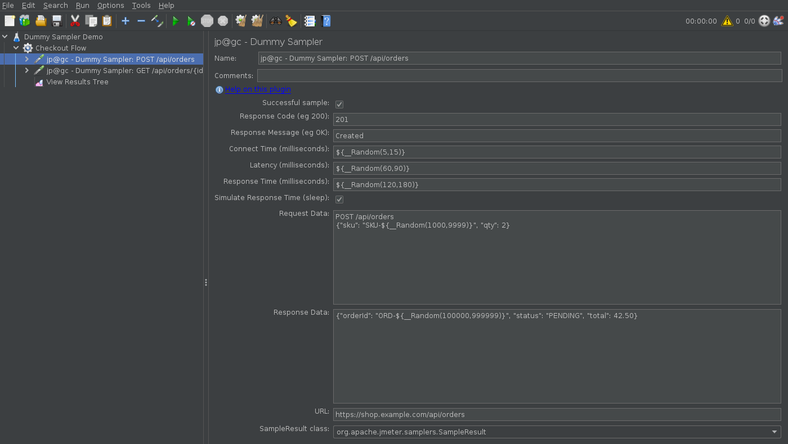
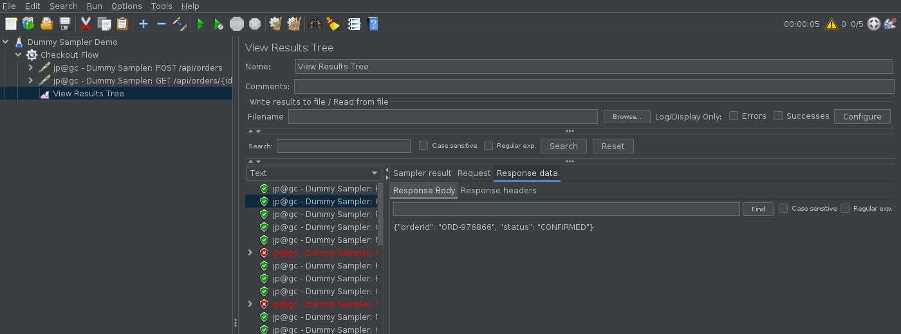

# JMeter Dummy Sampler: How to Mock API Responses and Debug Test Plans Without a Server

In this blog post, we will see how the JMeter Dummy Sampler plugin lets you build and debug a
complete test plan before the application you are testing even exists. If you have ever waited on a
test environment to come back up just so you could check whether a JSON Extractor regex was right,
this plugin is for you.

The Dummy Sampler (plugin id `jpgc-dummy`) is one of the most downloaded plugins on
jmeter-plugins.org, sitting right behind Custom Thread Groups, the Throughput Shaping Timer, and the
basic graphs in the [PerfAtlas download stats](/plugin/jpgc-dummy/). Despite that, most people only
use it as a placeholder sampler. It does a lot more than that, and I want to walk through the
practical side of it with a working example.

## 1. What is the JMeter Dummy Sampler?

The Dummy Sampler is a sampler that does no network activity at all. Instead of sending a request,
it produces a `SampleResult` with exactly the values you type into it: response code, response
message, response body, request body, response time, latency, connect time, and even the URL.

The official description on the
[jmeter-plugins.org wiki](https://jmeter-plugins.org/wiki/DummySampler/) puts it well: it is "the
most obedient of the JMeter samplers". It generates a sample with whatever you tell it to, every
single time.

That sounds trivial, but it unlocks three things that are hard to do any other way:

- **Debugging extractors and assertions offline.** Paste a real response body into the sampler and
  iterate on your JSON Extractor, Regular Expression Extractor, or JSR223 PostProcessor without
  hitting the server.
- **Building the test plan before the API exists.** Shift-left performance testing usually stalls
  because there is nothing to hit. With the Dummy Sampler you can model the whole flow, including
  correlation between steps, and swap in real HTTP Request samplers later.
- **Generating synthetic results.** Because it honours response time, latency, and success flags,
  you can produce a realistic-looking `.jtl` to validate listeners, Backend Listeners, dashboards,
  and CI thresholds.

## 2. Installing the Dummy Sampler plugin

The easiest way is through the Plugins Manager. If you do not have it yet, follow
[How to install JMeter Plugins Manager](/blog/how-to-install-jmeter-plugins-manger/) first. Then
open **Options > Plugins Manager > Available Plugins**, search for "Dummy Sampler", tick it, and
click **Apply Changes and Restart JMeter**.

For headless or Docker setups, use `PluginsManagerCMD` instead:

```bash
# from the JMeter home directory
java -cp lib/ext/jmeter-plugins-manager-1.10.jar \
  org.jmeterplugins.repository.PluginManagerCMDInstaller
bin/PluginsManagerCMD.sh install jpgc-dummy
```

I covered that flow end to end in
[JMeter Plugin Install Automation with PluginsManagerCMD in a Docker Image](/blog/jmeter-plugin-install-automation-pluginsmanagercmd-docker/).

The current release is 0.4, which ships a single jar, `jmeter-plugins-dummy-0.4.jar`, plus the
shared `jmeter-plugins-cmn-jmeter` library. After the restart you will see two new elements:

| Element                       | Where it lives        | Purpose                                           |
| ----------------------------- | --------------------- | ------------------------------------------------- |
| `jp@gc - Dummy Sampler`       | Add > Sampler         | Emits a fake sample with the values you configure |
| `jp@gc - Add Dummy Subresult` | Add > Post Processors | Attaches a fake sub-sample to the parent sample   |

## 3. Every Dummy Sampler field, explained

Here is the configuration screen from JMeter 5.6.3 on my machine, set up to fake a
`POST /api/orders` call:



Every text field accepts JMeter functions and variables, which is what makes the plugin useful
rather than a toy. Here is what each one does, taken from the plugin source
(`kg.apc.jmeter.dummy.DummyElement`):

| Field                          | JMX property       | Default                                   | Notes                                                                                   |
| ------------------------------ | ------------------ | ----------------------------------------- | --------------------------------------------------------------------------------------- |
| Successful sample              | `SUCCESFULL`       | checked                                   | Boolean checkbox. Sets `SampleResult.setSuccessful()`. Assertions can still override it |
| Response Code                  | `RESPONSE_CODE`    | `200`                                     | Any string. Functions are evaluated                                                     |
| Response Message               | `RESPONSE_MESSAGE` | `OK`                                      | Shows in listeners and the JTL `responseMessage` column                                 |
| Connect Time (ms)              | `CONNECT`          | `${__Random(1,5)}`                        | Written to `SampleResult.setConnectTime()`                                              |
| Latency (ms)                   | `LATENCY`          | `${__Random(1,50)}`                       | Written to `SampleResult.setLatency()`                                                  |
| Response Time (ms)             | `RESPONSE_TIME`    | `${__Random(50,500)}`                     | Becomes the `elapsed` column                                                            |
| Simulate Response Time (sleep) | `WAITING`          | checked                                   | If checked the thread really sleeps for Response Time ms; if not, the time is stamped   |
| Request Data                   | `REQUEST_DATA`     | placeholder text                          | Shown under the Request tab in View Results Tree                                        |
| Response Data                  | `RESPONSE_DATA`    | placeholder text                          | The body your extractors and assertions run against                                     |
| URL                            | `URL`              | empty                                     | Optional. Populates the `URL` column in the JTL                                         |
| SampleResult class             | `RESULT_CLASS`     | `org.apache.jmeter.samplers.SampleResult` | Lets you emit `HTTPSampleResult` or another subclass                                    |

Two details are worth calling out.

First, the misspelt property name `SUCCESFULL` (one S) is real. If you are generating JMX from a
template or editing it by hand, spell it the way the plugin does or the checkbox will silently reset
to unchecked.

Second, **Simulate Response Time (sleep)** is what separates "generate a fake result" from "behave
like a slow server". With it checked, the plugin calls `sampleStart()`, sleeps for the configured
milliseconds, then `sampleEnd()`, so the thread is genuinely occupied. With it unchecked, the
sampler returns instantly and just stamps the time onto the result. I will come back to why this
matters for throughput in section 6.

## 4. A practical example: mocking a two-step order flow

Let me build something realistic. The flow is: create an order, capture its id, then fetch the
order. In a real plan that is two HTTP Request samplers with a JSON Extractor in between. Here I
will do it entirely with Dummy Samplers so the correlation logic can be tested with zero
infrastructure.

### 4.1 Step one: POST /api/orders

Configure the first Dummy Sampler like this:

```text
Successful sample:      checked
Response Code:          201
Response Message:       Created
Connect Time:           ${__Random(5,15)}
Latency:                ${__Random(60,90)}
Response Time:          ${__Random(120,180)}
Simulate Response Time: checked
Request Data:           POST /api/orders
                        {"sku": "SKU-${__Random(1000,9999)}", "qty": 2}
Response Data:          {"orderId": "ORD-${__Random(100000,999999)}", "status": "PENDING", "total": 42.50}
URL:                    https://shop.example.com/api/orders
```

Under it, add a **JSON Extractor** with:

```text
Names of created variables: orderId
JSON Path expressions:      $.orderId
Match No.:                  1
Default Values:             NOT_FOUND
```

and a **JSON Assertion** asserting `$.status` equals `PENDING`.

### 4.2 Step two: GET /api/orders/{id}

The second Dummy Sampler consumes `${orderId}`:

```text
Successful sample:      checked
Response Code:          ${__jexl3(${__Random(1,100)} > 5 ? 200 : 503)}
Response Message:       OK
Connect Time:           0
Latency:                ${__Random(20,40)}
Response Time:          ${__Random(40,80)}
Simulate Response Time: checked
Request Data:           GET /api/orders/${orderId}
Response Data:          {"orderId": "${orderId}", "status": "CONFIRMED"}
URL:                    https://shop.example.com/api/orders/${orderId}
```

The `__jexl3` expression in the Response Code field returns `200` roughly 95% of the time and `503`
the other 5%. Add a **Response Assertion** on the _Response Code_ field with pattern `200` and
_Equals_ mode so those 503s get flagged as failures.

### 4.3 The equivalent JMX

If you prefer to drop this straight into a `.jmx`, this is the first sampler as JMeter saves it:

```xml
<kg.apc.jmeter.samplers.DummySampler guiclass="kg.apc.jmeter.samplers.DummySamplerGui"
    testclass="kg.apc.jmeter.samplers.DummySampler" testname="POST /api/orders">
  <boolProp name="WAITING">true</boolProp>
  <boolProp name="SUCCESFULL">true</boolProp>
  <stringProp name="RESPONSE_CODE">201</stringProp>
  <stringProp name="RESPONSE_MESSAGE">Created</stringProp>
  <stringProp name="REQUEST_DATA">POST /api/orders
{"sku": "SKU-${__Random(1000,9999)}", "qty": 2}</stringProp>
  <stringProp name="RESPONSE_DATA">{"orderId": "ORD-${__Random(100000,999999)}", "status": "PENDING", "total": 42.50}</stringProp>
  <stringProp name="RESPONSE_TIME">${__Random(120,180)}</stringProp>
  <stringProp name="LATENCY">${__Random(60,90)}</stringProp>
  <stringProp name="CONNECT">${__Random(5,15)}</stringProp>
  <stringProp name="URL">https://shop.example.com/api/orders</stringProp>
  <stringProp name="RESULT_CLASS">org.apache.jmeter.samplers.SampleResult</stringProp>
</kg.apc.jmeter.samplers.DummySampler>
```

### 4.4 Running it

I ran this with 5 threads, 1 second ramp-up, and 20 loops, first in the GUI to inspect it and then
in non-GUI mode to get a report:

```bash
bin/jmeter -n -t dummy-sampler-demo.jmx -l results.jtl -e -o report
```

The summariser output:

```text
summary =    200 in 00:00:05 =   39.9/s Avg:   105 Min:    40 Max:   179 Err:     9 (4.50%)
```

And the numbers from the HTML report's `statistics.json`:

| Label                  | Samples | Errors | Avg (ms) | Min | Max | 90th pct | Throughput/s |
| ---------------------- | ------- | ------ | -------- | --- | --- | -------- | ------------ |
| `POST /api/orders`     | 100     | 0      | 152      | 120 | 179 | 174      | 20.3         |
| `GET /api/orders/{id}` | 100     | 9      | 58       | 40  | 81  | 76       | 20.7         |
| Total                  | 200     | 9      | 105      | 40  | 179 | 171      | 40.1         |

Every one of those numbers came from my configuration, not from a server. The 4.5% error rate is the
`__jexl3` coin flip, the 120 to 179 ms range on the POST is the `__Random(120,180)`, and the
throughput is simply 5 threads divided by the sum of the sleep times.

In View Results Tree, you can confirm the correlation worked. The GET sample below shows the
`orderId` extracted from the previous POST response flowing into the response body and URL of the
next request:



The red entries in the tree are the simulated 503s failing the Response Assertion, exactly as they
would against a flaky real service.

## 5. Debugging extractors with real response bodies

This is the use case I reach for most often. When a Regular Expression Extractor is not matching and
the server round trip takes 3 seconds plus a login, the feedback loop is painful.

The workflow:

1. Run the real request once and copy the response body from View Results Tree.
2. Add a Dummy Sampler next to the real sampler and paste that body into **Response Data**.
3. Untick **Simulate Response Time (sleep)** so it returns instantly.
4. Move your extractor under the Dummy Sampler and add a **Debug Sampler** after it.
5. Disable the real sampler, run the thread group with 1 thread and 1 loop, and check the Debug
   Sampler output.

Each iteration now takes milliseconds. Once the extractor works, drag it back under the real sampler
and disable (do not delete) the Dummy Sampler so it is there next time.

For JSON, the same trick works with the JSON Extractor and JSON JMESPath Extractor. The Response
Data field stores the text exactly as pasted, including line endings, so a multi-line regex behaves
the same as it would against the live response.

One thing the Dummy Sampler does not fake is response headers. `SampleResult.setResponseHeaders()`
is never called, so a Regular Expression Extractor with **Field to check: Response Headers** will
find nothing. If you need to test header extraction, put the header text into Response Data
temporarily and switch the field to Body.

## 6. Generating realistic load data for dashboards and CI gates

Because the Dummy Sampler writes proper `elapsed`, `Latency`, `Connect`, `responseCode`, and
`success` values, listeners cannot tell the difference. That makes it ideal for validating
everything downstream of the sampler:

- A **Backend Listener** pointed at InfluxDB or Prometheus, as described in
  [Real-Time JMeter Metrics with Prometheus and Grafana](/blog/real-time-jmeter-metrics-with-prometheus-and-grafana-using-the-backend-listener/).
  You can build and tune Grafana panels against a stable, repeatable stream of fake data before the
  real test runs.
- **CI thresholds** such as the JMeter Maven plugin's error-percentage gate or a `Taurus` pass/fail
  criterion. Set the `__jexl3` failure rate to 6% and confirm your 5% gate actually fails the build.
- **Throughput Shaping Timer** schedules. Since a Dummy Sampler with sleep enabled behaves like a
  server with a fixed response time, you can check whether your thread count can actually reach the
  target RPS. If you set 50 threads with a 200 ms sleep, the ceiling is 250 RPS, no matter what the
  timer asks for. See
  [Throughput Shaping Timer vs Concurrency Thread Group](/blog/jmeter-throughput-shaping-timer-vs-concurrency-thread-group/)
  for why that ceiling matters.

Here is the mental model for that last point. With **Simulate Response Time** checked:

```text
max RPS per thread  = 1000 / (response time in ms)
max RPS overall     = threads * 1000 / response time
```

With it unchecked, a single thread can produce thousands of samples per second, which is great for
stress-testing a listener or a JTL writer but useless for anything timing related.

## 7. The Add Dummy Subresult post-processor

The second element the plugin installs is `jp@gc - Add Dummy Subresult`. It is a PostProcessor that
takes the same fields as the sampler and, when it runs, calls `addSubResult()` on the parent sample.

The use case from the official docs is simulating an HTTP Request with embedded resources: one
parent Dummy Sampler for the HTML page, then three or four Dummy Subresult post-processors under it
for CSS, JS, and image calls. In View Results Tree the parent becomes expandable, exactly like a
real page with **Retrieve All Embedded Resources** ticked.

This is handy when you are writing a custom listener or a JSR223 script that walks
`prev.getSubResults()`, and you want to test it without a real page load.

## 8. Common pitfalls

A few things I have tripped over or seen others trip over:

- **Putting a function in the Successful checkbox.** It is a checkbox, so you cannot. To simulate
  intermittent failures, randomise the Response Code as shown above and let a Response Assertion
  decide, or use an If Controller with two Dummy Samplers.
- **Forgetting to untick Simulate Response Time when debugging.** The default is checked with
  `${__Random(50,500)}`, so your "instant" debug loop is quietly adding up to half a second per
  sample.
- **Expecting Sent bytes or headers.** The plugin never sets `sentBytes` or response headers. Size
  in bytes is calculated from the Response Data you provide, so byte-based assertions work, but
  header-based ones do not.
- **Leaving Dummy Samplers enabled in the real test.** They inflate your sample counts and
  throughput. Disable them, or keep them in a separate Test Fragment that only a debug thread group
  references.
- **Assuming the URL field validates.** It is parsed with `java.net.URL`, and if parsing fails the
  plugin only logs at debug level and leaves the URL blank. If your JTL's URL column is empty, check
  for a missing scheme.

## 9. Dummy Sampler vs Debug Sampler vs HTTP Mirror Server

People often ask which of these to use, so here is a quick comparison:

| Need                                                  | Use                                       |
| ----------------------------------------------------- | ----------------------------------------- |
| Fake a response body to test extractors/assertions    | Dummy Sampler                             |
| Print current variables and properties                | Debug Sampler (built in)                  |
| Echo a real HTTP request back to see what was sent    | HTTP Mirror Server (built in, port 8081)  |
| Fake timings for listeners, dashboards, CI thresholds | Dummy Sampler with Simulate Response Time |
| Simulate a page with embedded resources               | Dummy Sampler + Add Dummy Subresult       |

My debugging thread group usually contains a Dummy Sampler, the extractor under test, and a Debug
Sampler right after it.

## Conclusion

The Dummy Sampler is small, has not needed a release since version 0.4, and still earns its place
near the top of the download charts because it solves a problem every performance engineer has: the
test plan needs work but the environment is not available. Paste in a response, wire up your
extractors, get the correlation right, and validate your reporting pipeline, all without a single
network call.

The main takeaway: treat the Dummy Sampler as a first-class part of your workflow, not a
placeholder. Keep one in every test plan, disabled, with the last known good response body pasted
in. The next time an extractor breaks at 2 AM, you will fix it in seconds instead of waiting on a
server.
