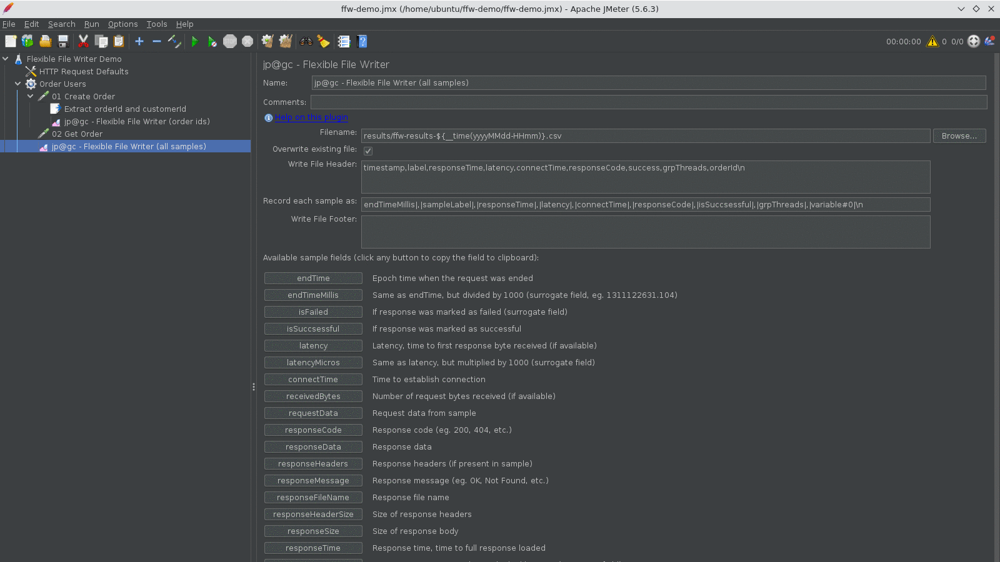
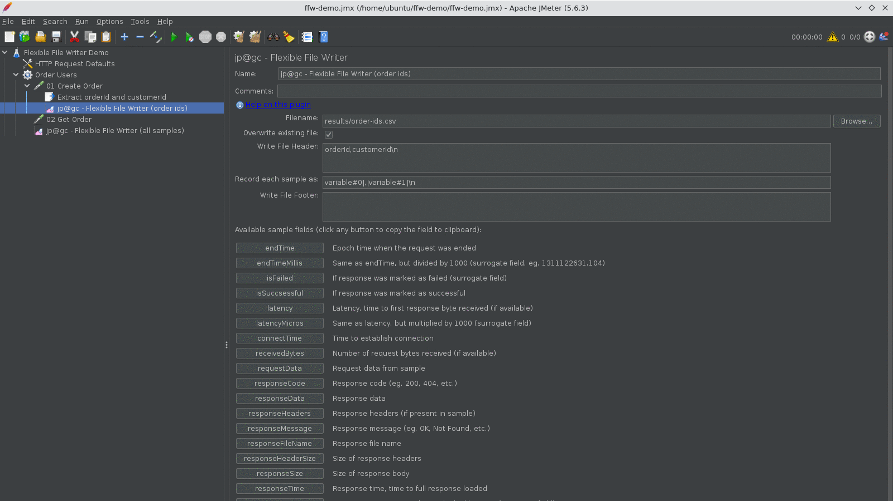
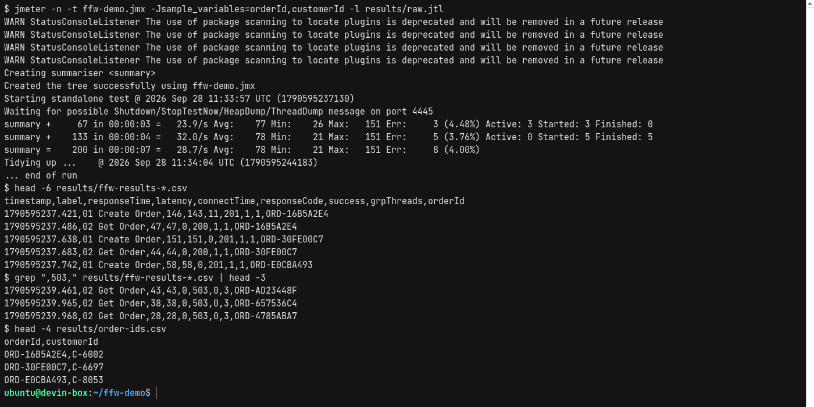

# JMeter Flexible File Writer: How to Write Custom CSV Results and Save Extracted Data

In this blog post, we will see how to use the JMeter Flexible File Writer plugin to write test
results in exactly the format you want, and how to use the same plugin to save extracted values like
order IDs or tokens to a CSV file during a load test. I will also cover three pitfalls I hit while
preparing this post, including one that silently writes the wrong value into every row.

The Flexible File Writer (plugin id `jpgc-ffw`) is one of the quiet workhorses of the jp@gc plugin
set. On the [PerfAtlas plugin page](/plugin/jpgc-ffw/) it shows around 10,700 downloads in the
latest weekly snapshot, which makes it the 8th most downloaded third-party plugin in the directory,
just ahead of Inter-Thread Communication. Yet there is very little written about it beyond the
one-page wiki. Let us fix that.

Everything below was run on Apache JMeter 5.6.3 with Flexible File Writer 2.0 against a small local
order API, and the screenshots are from that run.

## 1. What is the JMeter Flexible File Writer?

JMeter already has a Simple Data Writer and the standard `-l results.jtl` output. Both write CSV or
XML with a predefined set of columns controlled by the `jmeter.save.saveservice.*` properties. That
works for the HTML dashboard, but it falls short when you need:

- A file with only 5 columns in a specific order, for a downstream script or a data warehouse
- Tab separated, pipe separated, or JSON-lines output
- A custom header and footer
- One or two JMeter variables per row, such as an `orderId`, next to the timing data
- A small data file of extracted values that another test (or another team) can consume

The Flexible File Writer is a listener where you describe each output row with a template. Per the
[official wiki](https://jmeter-plugins.org/wiki/FlexibleFileWriter/), the template is made of field
names and string constants separated by the `|` character. The plugin adds nothing on its own, not
even a newline, so you write `\n` (or `\r\n`, `\t`) yourself.

For example, a tab separated file looks like this:

```text
startTime|\t|responseTime|\t|responseCode|\t|isSuccsessful|\r\n
```

Yes, `isSuccsessful` is spelled that way. Keep that in mind, we will come back to it in section 7.

## 2. Installing the plugin

The easiest way is the Plugins Manager: Options, Plugins Manager, Available Plugins, search for
"Flexible File Writer", tick it, and restart JMeter. If you do not have the Plugins Manager yet,
follow [How to install JMeter Plugins Manager](/blog/how-to-install-jmeter-plugins-manger/) first.

For CI agents and containers, install it headless:

```bash
./bin/PluginsManagerCMD.sh install jpgc-ffw
./bin/PluginsManagerCMD.sh status
# [jpgc-ffw=2.0, jpgc-plugins-manager=1.10, jmeter-core=5.6.3, ...]
```

Under the hood this drops `jmeter-plugins-ffw-2.0.jar` into `lib/ext` and
`jmeter-plugins-cmn-jmeter-0.7.jar` into `lib`. If you bake JMeter into an image, the
[PluginsManagerCMD in Docker](/blog/jmeter-plugin-install-automation-pluginsmanagercmd-docker/) post
shows the full pattern.

After a restart, you will find it under Add, Listener, `jp@gc - Flexible File Writer`.

## 3. The demo test plan

To keep things concrete, here is the plan I used. The target is a tiny local API with two endpoints:

- `POST /api/orders` returns `201` with `{"orderId": "ORD-XXXXXXXX", "customerId": "C-1234"}`
- `GET /api/orders/{orderId}` returns `200`, or `503` roughly 10% of the time

The test plan looks like this:

```text
Flexible File Writer Demo
├── HTTP Request Defaults            (localhost:8085)
└── Order Users                      (5 threads, 5 s ramp-up, 20 loops)
    ├── 01 Create Order              (POST /api/orders)
    │   ├── Extract orderId and customerId   (JSON Extractor)
    │   └── jp@gc - Flexible File Writer (order ids)
    ├── 02 Get Order                 (GET /api/orders/${orderId})
    └── jp@gc - Flexible File Writer (all samples)
```

There are two Flexible File Writers on purpose. One records every sample as a custom results file.
The other sits under a single sampler and only records the IDs that sampler extracted. Scope is how
you control what each writer sees, which we will look at in section 6.

## 4. Writing a custom CSV results file

Here is the configuration of the thread group level writer.



The four fields that matter:

| Field                   | Value used in the demo                                       |
| :---------------------- | :----------------------------------------------------------- |
| Filename                | `results/ffw-results-${__time(yyyyMMdd-HHmm)}.csv`           |
| Overwrite existing file | checked                                                      |
| Write File Header       | `timestamp,label,responseTime,latency,...,orderId\n`         |
| Record each sample as   | `endTimeMillis\|,\|sampleLabel\|,\|responseTime\|,\|...\|\n` |

The full record template is:

```text
endTimeMillis|,|sampleLabel|,|responseTime|,|latency|,|connectTime|,|responseCode|,|isSuccsessful|,|grpThreads|,|variable#0|\n
```

And the header:

```text
timestamp,label,responseTime,latency,connectTime,responseCode,success,grpThreads,orderId\n
```

A few notes on the settings:

- **Filename** accepts JMeter functions, but the wiki is clear that they are evaluated only once,
  when the test starts and the file is opened. `${__time(yyyyMMdd-HHmm)}` gives you one file per
  run, not one file per minute.
- **Overwrite existing file** is off by default. In the 2.0 source, the file is opened in append
  mode unless this box is ticked, so without it every run appends a new header and new rows to the
  same file.
- **Header and footer** are written once, when the file is opened and right before it is closed.
  They support `\n` and `\t` escapes.

In the JMX, the element is stored with plain property names, which makes it easy to template:

```xml
<kg.apc.jmeter.reporters.FlexibleFileWriter
    guiclass="kg.apc.jmeter.reporters.FlexibleFileWriterGui"
    testclass="kg.apc.jmeter.reporters.FlexibleFileWriter"
    testname="jp@gc - Flexible File Writer (all samples)">
  <stringProp name="filename">results/ffw-results-${__time(yyyyMMdd-HHmm)}.csv</stringProp>
  <boolProp name="overwrite">true</boolProp>
  <stringProp name="header">timestamp,label,responseTime,latency,connectTime,responseCode,success,grpThreads,orderId\n</stringProp>
  <stringProp name="columns">endTimeMillis|,|sampleLabel|,|responseTime|,|latency|,|connectTime|,|responseCode|,|isSuccsessful|,|grpThreads|,|variable#0|\n</stringProp>
  <stringProp name="footer"></stringProp>
</kg.apc.jmeter.reporters.FlexibleFileWriter>
```

## 5. Saving extracted variables with sample_variables and variable#N

This is the feature most people install the plugin for: writing a JMeter variable into the output.

The Flexible File Writer cannot read arbitrary variables by name. It reads **sample variables**,
which JMeter attaches to every sample result when you set the `sample_variables` property before the
test starts. The wiki notes that JMeter has no API to change this at runtime, so it must be set up
front, either on the command line or in `user.properties`:

```properties
# user.properties
sample_variables=orderId,customerId
```

Then you refer to them by zero-based index in the record template: `variable#0` is `orderId`,
`variable#1` is `customerId`.

The second writer in the demo sits under `01 Create Order` and uses this template:

```text
variable#0|,|variable#1|\n
```

With the header `orderId,customerId\n` and filename `results/order-ids.csv`.



Now run it in non-GUI mode:

```bash
jmeter -n -t ffw-demo.jmx -Jsample_variables=orderId,customerId -l results/raw.jtl
```



The run produced 200 samples in about 7 seconds with 8 errors (4.00%), all `503`s from
`02 Get Order`. Here is what the two files contain:

```text
$ head -3 results/ffw-results-20260928-1133.csv
timestamp,label,responseTime,latency,connectTime,responseCode,success,grpThreads,orderId
1790595237.421,01 Create Order,146,143,11,201,1,1,ORD-16B5A2E4
1790595237.486,02 Get Order,47,47,0,200,1,1,ORD-16B5A2E4

$ head -3 results/order-ids.csv
orderId,customerId
ORD-16B5A2E4,C-6002
ORD-30FE00C7,C-6697
```

Two things worth pointing out:

- The `orderId` on the `01 Create Order` row is the value extracted from that same response. JSON
  Extractor is a post-processor, and post-processors run before listeners are notified, so the
  sample variable already holds the new value.
- `order-ids.csv` has exactly 101 lines: one header plus one row for each of the 100 Create Order
  calls. That file can go straight into a CSV Data Set Config for a follow-up test, for example a
  cancel-order or reporting scenario.

Because the output is plain CSV, quick analysis is one `awk` away:

```bash
awk -F, 'NR>1 { n[$2]++; s[$2]+=$3; if ($7==0) e[$2]++ }
  END { for (k in n) printf "%s count=%d avg=%.1f errors=%d\n", k, n[k], s[k]/n[k], e[k] }' \
  results/ffw-results-*.csv
# 01 Create Order count=100 avg=105.2 errors=0
# 02 Get Order count=100 avg=51.2 errors=8
```

## 6. Controlling what gets written with scope

The Flexible File Writer has no filter setting. It writes one row for every sample it can see, and
what it can see is decided by normal JMeter scoping rules:

| Where you place it             | What it records                      |
| :----------------------------- | :----------------------------------- |
| Test Plan level                | Every sample from every thread group |
| Inside a thread group          | Every sample in that thread group    |
| As a child of a single sampler | Only that sampler's results          |
| Inside a controller            | Only samplers under that controller  |

That is how the `order-ids.csv` writer only ever sees `01 Create Order`. If you need "failed
requests only", keep one writer with `isSuccsessful` or `responseCode` as a column and filter the
file afterwards, as I did with `grep ",503,"` in the screenshot above.

If what you really need is to pass values between thread groups at runtime rather than to a file,
the
[Inter-Thread Communication plugin](/blog/jmeter-inter-thread-communication-plugin-share-data-between-thread-groups/)
is a better fit than writing and re-reading a CSV mid-test.

## 7. Three pitfalls I verified on 5.6.3

### 7.1 `isSuccessful` is written as a literal string

The field name the plugin recognises is `isSuccsessful`, with the typo. The field button in the GUI
uses the typo too. However, the default record template that the 2.0 GUI pre-fills when you add a
new writer uses the correct spelling:

```text
endTimeMillis|\t|responseTime|\t|latency|\t|sentBytes|\t|receivedBytes|\t|isSuccessful|\t|responseCode|\r\n
```

Any chunk that is not a known field is treated as a constant. So with the default template, every
row gets the text `isSuccessful` instead of `1` or `0`. Here is a test with both spellings in the
same template:

```text
sampleLabel|,|isSuccessful|,|isSuccsessful|,|responseSize|\n
# Big Catalog,isSuccessful,1,26935
```

Change it to `isSuccsessful`, or use `isFailed` which has no typo and gives you `1` on failure.

### 7.2 Missing sample_variables gives UNDEFINED_variable#0

If you reference `variable#0` but forget `-Jsample_variables=...`, the test still runs. Every row
gets the text `UNDEFINED_variable#0` and `jmeter.log` fills up with
`WARN k.a.j.r.FlexibleFileWriter: variable#0 does not exist!`. In CI, set the property in the same
place you set other run properties, so it cannot be forgotten.

### 7.3 Large responseData silently drops rows

Each row is composed in a buffer controlled by the `kg.apc.jmeter.reporters.FFWBufferSize` property,
10 KB by default. I pointed the writer at a 26,935 byte response with
`sampleLabel|,|responseData|\n`. The result was an empty file and this in the log for every sample:

```text
ERROR o.a.j.t.ListenerNotifier: Detected problem in Listener.
java.nio.BufferOverflowException: null
    at kg.apc.jmeter.reporters.FlexibleFileWriter.appendSampleResultField(FlexibleFileWriter.java:366)
```

The test itself keeps running and reports no errors, so this is easy to miss. Raising the buffer
fixed it, and the same run wrote 53,896 bytes:

```bash
jmeter -n -t pitfalls.jmx -Jkg.apc.jmeter.reporters.FFWBufferSize=65536
```

Size the buffer for the largest row you expect, not the average. Better still, avoid writing full
response bodies during a load test. Debug bodies with a handful of threads, or mock them with the
[Dummy Sampler](/blog/jmeter-dummy-sampler-mock-api-responses-debug-test-plans/) while building the
plan.

## 8. Useful fields and a note on bytes

The GUI lists every field with a description. The ones I use most:

| Field                                | What you get                                           |
| :----------------------------------- | :----------------------------------------------------- |
| `endTimeMillis`                      | Epoch seconds with milliseconds, e.g. `1790595237.421` |
| `responseTime`, `latency`            | Milliseconds, same as `elapsed` and `Latency` in a JTL |
| `connectTime`                        | Connection time in milliseconds                        |
| `responseCode`                       | `200`, `503`, and so on                                |
| `isSuccsessful`, `isFailed`          | `1` or `0`                                             |
| `grpThreads`, `threadsCount`         | Active threads in this group, and in all groups        |
| `sampleLabel`, `URL`                 | Sampler name and full URL                              |
| `responseSize`, `responseHeaderSize` | Body and header sizes                                  |
| `variable#N`                         | Sample variable at index N                             |

One detail from the plugin source: `sentBytes` is computed from the length of the recorded request
data, and `receivedBytes` from the length of the response body. They can differ from the `bytes` and
`sentBytes` columns of a standard JTL, which include headers. If you need network-level byte counts
for bandwidth calculations, take them from the JTL.

## 9. Flexible File Writer or the standard JTL?

I do not treat the Flexible File Writer as a replacement for `-l results.jtl`. The HTML dashboard,
Backend Listeners, and most reporting tools expect the standard format. What I do is run both:

- Keep the standard JTL for the dashboard and for comparing runs over time
- Add a Flexible File Writer when a downstream consumer needs a specific shape, or when you need to
  capture test data such as created IDs, tokens, or tenant keys

The cost is small. Both writers in the demo together added a few kilobytes of output for 200
samples. Just keep `responseData` and `requestData` out of the template under real load.

## Conclusion

The JMeter Flexible File Writer is the simplest way to get test results in your own format and to
save extracted data to a file, with nothing more than a record template and the `sample_variables`
property. Place it carefully to control scope, spell `isSuccsessful` the plugin's way, set
`sample_variables` before the run, and raise `FFWBufferSize` if a row can exceed 10 KB. Do those
four things and it will quietly produce clean CSVs run after run.

You can find download trends, versions, and the install ID on the
[Flexible File Writer page](/plugin/jpgc-ffw/) on PerfAtlas.

Happy Testing!
