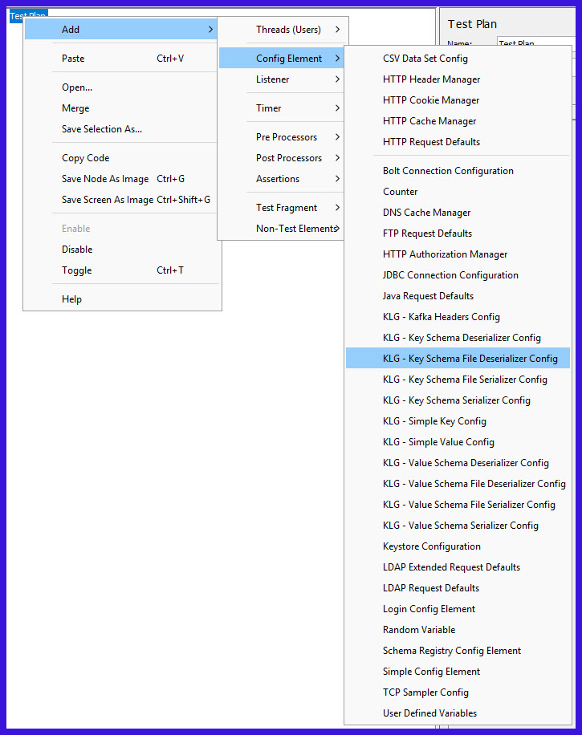

# **JMeter KLoadGen Plugin for Kafka Load Testing with AVRO and Protobuf Schemas - 2026 Practical Guide**

If you're load-testing Kafka in 2026, you're probably not sending plain strings. Real pipelines use Confluent Schema Registry with AVRO, JSON Schema, or Protobuf — and your test tool needs to speak those formats natively. That's exactly where KLoadGen fits.

## What KLoadGen actually does

Kafka Load Generator, aka KLoadGen, is a JMeter plugin that allows generating and injecting synthetic data into a Kafka-based, event architecture. It was built to work without external libraries, embedding the latest supported Kafka clients directly.

Original docs describe it as designed to work with AVRO and JSON schemas, connecting to Schema Registry, retrieving the subject, and generating a random message every time. Current releases extend that core:

- Supports **AVRO, JSON and Protobuf schemas**
- Load Generation JMeter plugin for Kafka Cluster supporting AVRO, JSON Schema and Protobuf schema types, generating artificial data based on data specification
- Also described as designed to work with AVRO, JSON Schema, and PROTOBUF structures for sending Kafka messages

It runs on any JMeter machine with JRE 8 or higher, MPL-2.0 licensed, and maintained by Sngular/Corunet.

## Why this matters for long-tail SEO scenarios

Teams searching for these specific problems land here:

- "jmeter kafka load testing avro schema registry"
- "kloadgen protobuf performance test without coding producer"
- "how to generate avro messages in jmeter with schema evolution"
- "kafka key value avro load test jmeter plugin"
- "test protobuf kafka topic with jmeter and schema registry"

KLoadGen solves them because it handles both key and value schemas, not just payloads.

## Core components you'll use

KLoadGen includes eight main components built as JMeter elements:

- **Kafka Schema Sampler**: sends messages to Kafka, uses value and key configuration and generates data matching that definition
- **Kafka Consumer Sampler**: reads messages from Kafka, uses the value and key configuration to deserialize read messages
- **Schema Registry Config**: configures connection to Schema Registry, security, auth
- **Value Serialized Config / Value File Serialized Config**: pull schema from registry or upload.avsc/.json/.proto locally
- **Key Serialized Config / Key File Serialized Config**: same for keys
- **Kafka Headers Config**: adds serialized headers

Key differentiator: data generation for both basic data types AND complex structures such as arrays or maps, plus specifying schemas for Key and Values.

## AVRO vs Protobuf in KLoadGen

| Feature | AVRO testing | Protobuf testing |
| --- | --- | --- |
| Schema source | Schema Registry subject or.avsc file | Schema Registry subject or.proto file |
| Evolution testing | Backward/forward compatibility via registry versions | Same, with Protobuf field numbering rules |
| Data generation | Respects logical types, unions, arrays, maps | Respects nested messages, repeated fields, enums |
| Typical use case | "jmeter avro schema registry load test for clickstream" | "jmeter protobuf kafka performance test for gRPC events" |

## Step-by-step: Kafka AVRO load test

**1. Install**
- Download kloadgen 5.1.6 from Maven Central or GitHub, drop jar into JMETER_HOME/lib/ext. Restart JMeter.

**2. Add Schema Registry Config**
- Thread Group > Add > Config Element > Schema Registry Config
- URL: http://schema-registry:8081
- Auth: Basic or SSL if needed

**3. Define AVRO value**
- Add > Config Element > Value Serialized Config
- Choose "AVRO", Subject: `orders-value`, Version: latest
- Or use Value File Serialized Config and upload orders.avsc

**4. Define key (often overlooked)**
- Add Key Serialized Config > AVRO > `orders-key`
- This improves partitioning realism and cluster performance, as KLoadGen highlights

**5. Producer sampler**
- Add > Sampler > Kafka Schema Sampler
- Bootstrap: kafka:9092, Topic: orders
- Throughput: set messages/sec, use Constant Throughput Timer for realistic ramp

**6. Consumer validation (optional)**
- Add Kafka Consumer Sampler with matching deserializer to verify latency end-to-end

Run with 50-200 threads, watch producer latency, not just JMeter response time.

## Step-by-step: Kafka Protobuf load test

Protobuf workflow is nearly identical, the long-tail difference is the schema file handling:

1. Upload.proto via Value File Serialized Config. KLoadGen builds a descriptor from a proto file internally.
2. In Schema Registry Config, set `value.subject.name.strategy` to TopicNameStrategy if using Confluent Protobuf serializer.
3. For nested messages, KLoadGen's generator will populate repeated fields and enums automatically based on constraints.
4. Test schema evolution by switching Subject Version from 1 to 2 in the config — no code change needed.

This is why searches like "kloadgen protobuf schema registry without java producer" convert — you avoid writing a custom serializer.

## Best practices from real deployments

- **Generate from constraints, not random junk**: Use JSON Schema constraints or AVRO logical types so data looks production-like. KLoadGen's generator respects schema constraints.
- **Test key serialization separately**: Bad key schemas cause hot partitions. Run a 5-minute key-only test first.
- **Match producer configs to prod**: linger.ms, batch.size, acks, compression.type — KLoadGen embeds Kafka libs so you can set them natively.
- **Monitor Schema Registry**: version bumps during a test cause serialization errors. Lock versions for baseline tests.
- **Combine with JMeter backend listener**: push throughput, error %, p99 produce latency to Prometheus/Grafana for long-tail reporting like "kafka avro p99 latency under 10k msgs/sec".

## When to choose KLoadGen over Pepper-Box

Pepper-Box pioneered JMeter-Kafka testing but lacks first-class Protobuf and modern Schema Registry integration. KLoadGen was explicitly thanked to Pepper-Box for the base ideas, then extended for AVRO/JSON/Protobuf. If your query is "pepper box vs kloadgen for protobuf", choose KLoadGen.

## Grounded takeaway

For teams running event-driven architectures in 2026, testing with real schemas isn't optional — it's how you catch serialization failures, compatibility breaks, and partition skew before prod. KLoadGen gives you a no-code JMeter path to generate AVRO, JSON Schema, and Protobuf traffic directly against Schema Registry, with full key/value support and complex-type generation built in.

