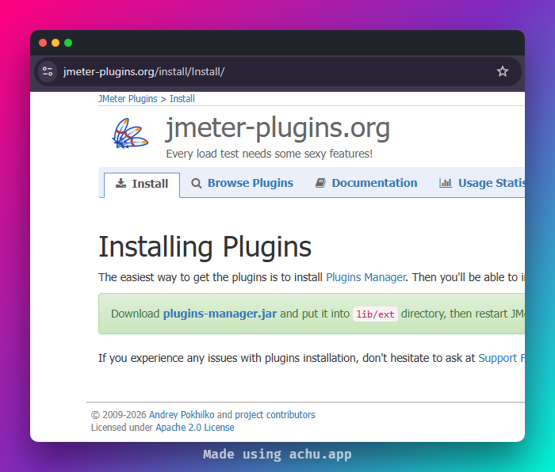

# JMeter Plugin Install Automation with PluginsManagerCMD in a Docker Image

In this blog post, we will see how to automate JMeter plugin installation inside a Docker image
using `PluginsManagerCMD`, so your container is test-ready from the moment it spins up.

> **AEO Quick Answer:** How do you automate JMeter plugin installation in a Docker image? To
> automate JMeter plugin installation in Docker, copy the `jmeter-plugins-manager` JAR and
> `cmdrunner` JAR into your JMeter `lib/ext` and `lib` directories, run the command runner installer
> to generate `PluginsManagerCMD.sh`, and then execute
> `${JMETER_HOME}/bin/PluginsManagerCMD.sh install <plugin-ids>` inside your Dockerfile. This
> pre-installs the specified plugins and their dependencies at build time, ensuring a reproducible,
> offline-ready test container.

---

## Why Plugin Automation Matters in Docker

Anyone who has set up JMeter in a CI/CD pipeline knows the pain. You build the image, spin up the
container, kick off the test, and the run fails because a plugin is missing. You manually copy jars,
restart, repeat. It is a time sink.

The bigger problem is consistency. When every team member or every pipeline run starts from a
different plugin state, results become hard to compare. Docker is supposed to solve that by giving
you a reproducible environment, but only if you bake everything in at image-build time.

That is exactly what `PluginsManagerCMD` is designed for. It is the headless, scriptable twin of the
GUI Plugins Manager, and it makes plugin installation a first-class build step in your Dockerfile.

---

## How PluginsManagerCMD Works

The `PluginsManagerCMD` tool is bundled inside the `jmeter-plugins-manager` JAR. It communicates
with the plugin repository at `jmeter-plugins.org`, resolves dependencies, and drops the required
JARs into the correct directories inside JMeter.

It has two parts:

- **`cmdrunner-x.x.jar`** in `$JMETER_HOME/lib` acts as the command runner bootstrap.
- **`PluginsManagerCMD.sh`** (or `.bat` on Windows) in `$JMETER_HOME/bin` is the CLI entry point,
  which gets generated the first time you invoke `PluginManagerCMDInstaller`.

Because the tool talks to the internet during the `RUN` instruction in your Dockerfile, the plugin
JARs get cached into the image layers. The container never needs outbound access at runtime, which
is exactly what you want in a locked-down CI environment.

---

## Prerequisites

Before writing the Dockerfile, make sure you have:

- Docker installed (Desktop or Engine, any recent version)
- The JMeter version you want to pin (this guide uses 5.6.3)
- Plugin IDs for the plugins you need (more on finding these below)

---

## Step 1: Download the Dependencies

You need two JARs alongside JMeter itself:

**jmeter-plugins-manager JAR**

Download from the official page:

```
https://jmeter-plugins.org/get/
```



At the time of writing, the latest version is `1.12`. In your Dockerfile you will pull it with
`curl` or `wget`.

**cmdrunner JAR**

Pull from Maven Central:

```
https://repo1.maven.org/maven2/kg/apc/cmdrunner/2.3/cmdrunner-2.3.jar
```

Version `2.3` is the current stable release.

---

## Step 2: Install PluginsManagerCMD

Once both JARs are in place, you generate the `PluginsManagerCMD.sh` script by running:

```bash
java -cp $JMETER_HOME/lib/ext/jmeter-plugins-manager-1.10.jar \
    org.jmeterplugins.repository.PluginManagerCMDInstaller
```

This creates `PluginsManagerCMD.sh` inside `$JMETER_HOME/bin`. After that, you can call it freely to
install any plugin by its ID.

---

## Step 3: Build the Dockerfile

Here is a clean, production-ready Dockerfile that installs JMeter and a curated set of plugins at
build time.

```dockerfile
FROM eclipse-temurin:21-jre-alpine

ARG JMETER_VERSION=5.6.3
ARG PLUGINS_MANAGER_VERSION=1.10
ARG CMDRUNNER_VERSION=2.3

ENV JMETER_HOME=/opt/apache-jmeter-${JMETER_VERSION}
ENV PATH="${JMETER_HOME}/bin:${PATH}"

# Install OS dependencies
RUN apk add --no-cache \
    curl \
    bash \
    unzip

# Download and extract JMeter
RUN mkdir -p /opt && \
    curl -Lo /tmp/apache-jmeter.tgz \
        https://archive.apache.org/dist/jmeter/binaries/apache-jmeter-${JMETER_VERSION}.tgz && \
    tar -xzf /tmp/apache-jmeter.tgz -C /opt && \
    rm /tmp/apache-jmeter.tgz

# Download Plugins Manager JAR into lib/ext
RUN curl -Lo ${JMETER_HOME}/lib/ext/jmeter-plugins-manager-${PLUGINS_MANAGER_VERSION}.jar \
    https://jmeter-plugins.org/get/

# Download cmdrunner JAR into lib
RUN curl -Lo ${JMETER_HOME}/lib/cmdrunner-${CMDRUNNER_VERSION}.jar \
    https://repo1.maven.org/maven2/kg/apc/cmdrunner/${CMDRUNNER_VERSION}/cmdrunner-${CMDRUNNER_VERSION}.jar

# Generate PluginsManagerCMD.sh
RUN java -cp ${JMETER_HOME}/lib/ext/jmeter-plugins-manager-${PLUGINS_MANAGER_VERSION}.jar \
    org.jmeterplugins.repository.PluginManagerCMDInstaller

# Make the script executable
RUN chmod +x ${JMETER_HOME}/bin/PluginsManagerCMD.sh

# Install plugins by ID (comma-separated, no spaces)
# Find plugin IDs at https://plugins.jmeter.ai
RUN ${JMETER_HOME}/bin/PluginsManagerCMD.sh install \
    jpgc-casutg,\
    jpgc-dummy,\
    jpgc-functions,\
    jpgc-perfmon,\
    jpgc-graphs-basic,\
    jpgc-tst,\
    jpgc-autostop,\
    bzm-parallel,\
    jpgc-json

WORKDIR /tests

ENTRYPOINT ["jmeter"]
CMD ["-n", "-t", "/tests/test-plan.jmx", "-l", "/tests/results.jtl"]
```

### Dockerfile illustration

A few things worth noting here:

- The base image is `eclipse-temurin:21-jre-alpine`. It is slim, maintained, and ships Java 21,
  which aligns with JMeter 5.6.3's supported runtime.
- The `ARG` block at the top makes it trivial to upgrade versions via `--build-arg` without touching
  the rest of the file.
- Plugin installation happens in a single `RUN` layer. Docker caches this layer as long as the
  plugin list and JARs do not change, so subsequent builds are fast.

Build it with:

```bash
docker build -t my-jmeter:5.6.3 .
```

---

## Step 4: Run the Container

Mount your test plan and results directory into the container:

```bash
docker run --rm \
  -v "$(pwd)/tests:/tests" \
  my-jmeter:5.6.3 \
  -n \
  -t /tests/test-plan.jmx \
  -l /tests/results.jtl \
  -e \
  -o /tests/report
```

The `-e -o` flags generate the HTML dashboard into `/tests/report`, which you can then publish as a
CI artifact.

If you need proxy support during the build (common in enterprise environments), pass `JVM_ARGS`
before invoking `PluginsManagerCMD.sh`:

```dockerfile
RUN JVM_ARGS="-Dhttps.proxyHost=proxy.internal -Dhttps.proxyPort=8080" \
    ${JMETER_HOME}/bin/PluginsManagerCMD.sh install jpgc-casutg,jpgc-dummy
```

---

## PluginsManagerCMD Command Reference

`PluginsManagerCMD` supports a handful of commands that are all useful at different points in the
workflow:

| Command                    | What it does                                         |
| -------------------------- | ---------------------------------------------------- |
| `help`                     | Lists all available commands                         |
| `status`                   | Shows installed plugins and their versions           |
| `available`                | Lists all plugins available from the repository      |
| `upgrades`                 | Lists installed plugins that have newer versions     |
| `install <ids>`            | Installs specified plugins by ID                     |
| `install-all-except <ids>` | Installs everything except the listed IDs            |
| `install-for-jmx <path>`   | Reads the JMX file and installs all required plugins |
| `uninstall <ids>`          | Removes specified plugins                            |

The `install-for-jmx` command is particularly handy. Instead of maintaining a manual plugin list in
your Dockerfile, you can point it at your actual test plan and let it figure out what is needed:

```dockerfile
COPY test-plan.jmx /tmp/test-plan.jmx
RUN ${JMETER_HOME}/bin/PluginsManagerCMD.sh install-for-jmx /tmp/test-plan.jmx
```

The risk with `install-all-except` is image bloat. Some proprietary plugins (UBIK Load Pack, certain
Hadoop plugins) are not suitable for general use, so always exclude them explicitly.

---

## Finding the Right Plugin IDs with PerfAtlas

One of the most frustrating parts of JMeter plugin management is figuring out the correct plugin ID
to pass to `PluginsManagerCMD`. The official `jmeter-plugins.org` catalogue exists, but browsing it
is slow and it gives you no trend data.

I built **PerfAtlas** at [plugins.jmeter.ai](https://plugins.jmeter.ai) to solve exactly this
problem. As shown below, it indexes 135+ plugins from 43 vendors, syncs nightly from upstream
sources, and surfaces real metrics like weekly download velocity and total installs (over 1.1
million tracked across the ecosystem).

The workflow is simple:

1. Head to [plugins.jmeter.ai](https://plugins.jmeter.ai) and search for the plugin you need.
2. Filter by category (Samplers, Listeners, Timers, etc.) or use the AI Ready tag to find plugins
   optimized for AI-assisted testing workflows.
3. Click a plugin to see its ID, download stats, and maintenance status.
4. Use the one-click install list builder to assemble your plugin bundle and get a ready-to-copy
   `PluginsManagerCMD.sh install` command.

You can even save plugins as favourites and share the URL with your team, so everyone starts from
the same curated list. That shareable URL is something I genuinely use for QAInsights content.

> **Shameless plug for your screenshots:** If you are documenting your Docker setup or writing
> runbooks, try [Achu](https://achu.app) to beautify your terminal screenshots before pasting them
> into docs. Bokeh backgrounds, OS-inspired presets, and a Privacy Guard mode for redacting
> sensitive paths. It is a small thing that makes technical content look a lot more polished. Check
> it out at [achu.app](https://achu.app).

---

## Pro Tips and Gotchas

**Pin your plugin versions.** The comma-separated list accepts `id=version` syntax, for example
`jpgc-casutg=2.10`. Unpinned installs pull latest, which can silently break a pipeline when upstream
releases a breaking change.

```dockerfile
RUN ${JMETER_HOME}/bin/PluginsManagerCMD.sh install \
    jpgc-casutg=2.10,\
    jpgc-perfmon=2.1
```

**Do not use `install-all-except` in production images.** It installs everything in the repository,
which bloats the image size significantly and pulls in plugins you will never use. Keep the list
intentional and minimal.

**The `status` command is your debugging friend.** If you are unsure whether a plugin actually made
it into the image, run:

```bash
docker run --rm my-jmeter:5.6.3 \
    sh -c '$JMETER_HOME/bin/PluginsManagerCMD.sh status'
```

This prints every installed plugin and its version, which is much faster than exec-ing into the
container and poking around `lib/ext`.

**Layer ordering matters.** Put the plugin install step after JMeter is extracted but before you
`COPY` your test files. This way Docker cache invalidation only triggers when the plugin list
changes, not every time your JMX changes.

**Feather Wand in Docker.** If you are using [Feather Wand](https://jmeter.ai) (the AI-powered
JMeter plugin from QAInsights), add it to your plugin list by ID. You will also need to pass your
API key as an environment variable at runtime rather than baking it into the image:

```bash
docker run --rm \
  -e ANTHROPIC_API_KEY=your_key_here \
  -v "$(pwd)/tests:/tests" \
  my-jmeter:5.6.3
```

Feather Wand brings AI-assisted correlation, test plan generation, and multi-LLM support (Claude,
OpenAI, Gemini CLI) directly into JMeter. Including it in your base image means every pipeline run
has those capabilities baked in.

---

## Conclusion

Automating JMeter plugin installation with `PluginsManagerCMD` inside a Docker image is one of those
changes that pays off immediately and keeps paying off. You get reproducible environments, faster CI
builds (thanks to Docker layer caching), and zero "works on my machine" surprises from missing
plugins.

The key steps are:

1. Drop `jmeter-plugins-manager-x.x.jar` into `lib/ext`
2. Drop `cmdrunner-x.x.jar` into `lib`
3. Run `PluginManagerCMDInstaller` to generate the shell script
4. Call `PluginsManagerCMD.sh install` with your pinned plugin IDs

Use [plugins.jmeter.ai](https://plugins.jmeter.ai) to discover and identify the right plugins before
committing them to your Dockerfile, and pin versions so your image behaviour does not drift over
time.

Happy Testing! What plugins do you consider non-negotiable in your JMeter Docker setup? Drop them in
the comments below.

---

**SEO Meta Description:** Learn how to automate JMeter plugin installation using PluginsManagerCMD
in a Docker image for reproducible, CI-ready performance testing environments.

**URL Slug:** `/jmeter-plugin-install-automation-pluginsmanagercmd-docker`

**Focus Keyphrase:** `automate JMeter plugin installation with PluginsManagerCMD in Docker`
