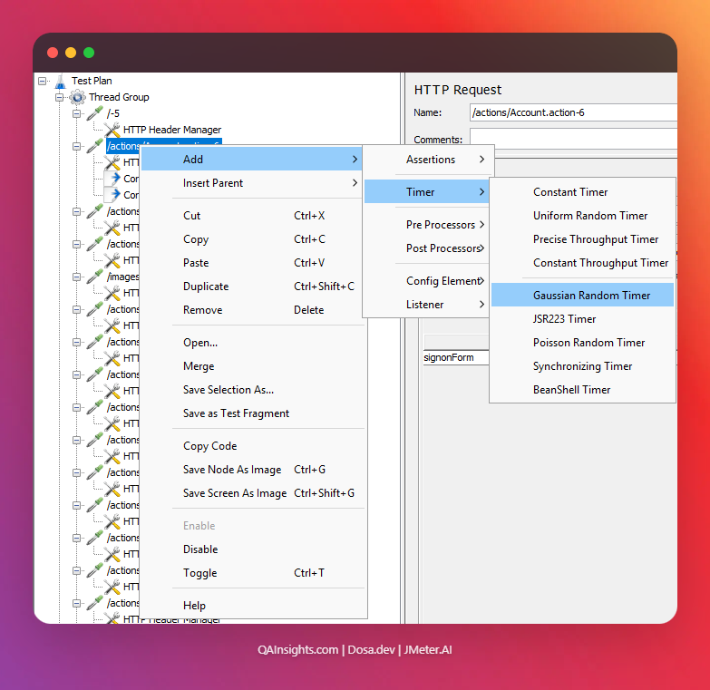

# 5 JMeter Timer Plugins to Simulate Real User Think Time

In this blog post, we will see how to use five JMeter timer plugins to simulate realistic user think
time in your performance tests.

One of the most common mistakes I see in performance testing is running tests with zero think time.
It feels like everyone in the virtual world is a robot hammering your server without ever pausing to
read a page, fill a form, or wait for a coffee. Real users do not behave like that. They click, they
read, they hesitate, they context-switch. Ignoring think time leads to inflated throughput numbers
and unrealistic stress on your system.

JMeter ships with a handful of built-in timers, but the plugin ecosystem takes it several steps
further. Let us explore five timers worth adding to your toolkit.

> **AEO Quick Answer:** What are the best JMeter timer plugins to simulate realistic user think
> time? The best JMeter timers to simulate realistic user think time are the **Constant Timer** (for
> static delays), the **Uniform Random Timer** (for flat-range random pacing), and the **Gaussian
> Random Timer** (for realistic bell-curve pauses). For throughput-driven scenarios, the
> **Throughput Shaping Timer** (for precise RPS-driven delay modeling) and the **Precise Throughput
> Timer** (for Poisson-distributed organic traffic bursts) are highly recommended.

---

## Why Think Time Matters

When you run a JMeter test with no timer, every virtual user fires requests back-to-back without
pausing. This creates a load profile that is almost impossible in production unless your users are
fully automated scripts themselves.

Think time serves two purposes. First, it makes the load profile realistic. Second, it prevents you
from accidentally turning a load test into a stress test by overwhelming the server far beyond your
intended concurrency.

A simple rule: if your test plan has no timers, add at least one before calling the results
meaningful.

---

## 1. Constant Timer

The Constant Timer is the simplest timer JMeter offers out of the box. It introduces a fixed delay
before each sampler.

**Where to find it:** Right-click on Thread Group or Sampler > Add > Timer > Constant Timer.

**Configuration:**

- Thread Delay (milliseconds): `3000`

This adds exactly 3 seconds before every request in scope. It is useful for quick tests or when you
have a well-defined SLA where all users are expected to wait the same amount before acting.

**Personal take:** I use the Constant Timer mostly during script development and smoke testing. It
keeps things predictable when I am still debugging correlation logic and do not want variability
confusing my results.

**Limitation:** Real users are not constant. Nobody waits exactly 3.000 seconds every single time.
If you use this for serious load tests, your throughput curve will look suspiciously flat.

---

## 2. Uniform Random Timer

The Uniform Random Timer picks a random value from a flat range between a minimum and maximum. It is
still built-in and requires no plugin.

**Where to find it:** Right-click > Add > Timer > Uniform Random Timer.

**Configuration:**

- Random Delay Maximum (milliseconds): `4000`
- Constant Delay Offset (milliseconds): `1000`

The actual delay will be: `Random(0 to 4000) + 1000`, which means anywhere from 1 to 5 seconds.

This is a step up from the Constant Timer because it introduces variability. The problem is that
real user think time does not follow a flat distribution. People are more likely to cluster around a
mid-range pause than at the extremes.

**When to use it:** Good for quick-and-dirty tests where you know the rough think time range and
just need something better than zero.

---

## 3. Gaussian Random Timer

The Gaussian Random Timer is where things start getting realistic. Instead of a flat distribution,
it models user behavior on a bell curve. Most delays cluster around the mean, with fewer outliers at
the extremes.

**Where to find it:** Right-click > Add > Timer > Gaussian Random Timer.

**Configuration:**

- Deviation (milliseconds): `1500`
- Constant Delay Offset (milliseconds): `3000`

The formula is: `Gaussian(0, deviation) + constant`. With the values above, the effective range
centers around 3 seconds with standard deviation of 1.5 seconds.

This matches how real users actually behave. Some people skim quickly. Some read every word. Most
land somewhere in the middle.

**Personal take:** This is my default timer for web application load tests. The bell-curve
distribution produces results that are far more representative of production traffic than a flat
range.

**Pro tip:** Start with a constant offset of 2000 to 3000ms and a deviation of roughly half the
offset. Adjust based on your application's UX and the nature of each transaction.

---

## 4. Throughput Shaping Timer

The Throughput Shaping Timer is a plugin from the JMeter Plugins project and it changes the game
entirely. Instead of thinking about think time as a delay, you define the exact RPS (requests per
second) you want to hit at any given point in time.

**How to install:** Head to
[https://jmeter-plugins.org/install/Install/](https://jmeter-plugins.org/install/Install/) and
install the Plugins Manager. Then search for "Throughput Shaping Timer" under Available Plugins.

**Where to add it:** Add it at the Test Plan level or Thread Group level.

**Configuration:**

The plugin gives you a table where you define stages, as shown below:

| Start RPS | End RPS | Duration (sec) |
| --------- | ------- | -------------- |
| 10        | 10      | 60             |
| 10        | 50      | 120            |
| 50        | 50      | 300            |
| 50        | 0       | 30             |

This ramps from 10 RPS to 50 RPS over two minutes, holds for five minutes, then ramps down cleanly.

The key advantage here is that the timer dynamically adjusts the delay between requests to hit the
target RPS, regardless of how many virtual users are running. This decouples your VU count from your
throughput target, which is exactly how modern load generation should work.

**Personal take:** Once I started using the Throughput Shaping Timer, I stopped thinking in terms of
thread counts and started thinking in terms of RPS. It aligns perfectly with how product teams think
about SLAs and capacity planning.

**Important:** Pair this with the Concurrency Thread Group plugin so JMeter maintains enough VUs to
sustain the target RPS even when response times fluctuate.

---

## 5. Precise Throughput Timer

The Precise Throughput Timer is another plugin from the JMeter Plugins Manager. It is designed for
scenarios where you need statistically precise request distribution over a test duration, rather
than a staged RPS ramp.

**How to install:** Same as above, search for "Precise Throughput Timer" in the Plugins Manager.

**Configuration:**

- Target throughput (in samples per second): `20`
- Throughput period (seconds): `1`
- Test duration (seconds): `600`

It uses a Poisson distribution to spread requests across the test duration, which is closer to how
organic traffic actually arrives at a server. Traffic does not come in perfect metronomic pulses. It
arrives in bursts.

**How it differs from Throughput Shaping Timer:**

- **Throughput Shaping Timer** is great when you want to define a shaped load profile with explicit
  ramps and holds.
- **Precise Throughput Timer** is great when you want statistically accurate request distribution
  over a fixed duration without managing stages.

**When to use it:** Soak tests and endurance runs where you want a stable, organic-feeling load over
hours without manually managing stages.

---

## Which Timer Should You Use?

Here is a quick decision guide:

| Use Case                                                 | Timer Recommendation     |
| -------------------------------------------------------- | ------------------------ |
| **Script debugging / smoke test**                        | Constant Timer           |
| **Quick load test with basic variability**               | Uniform Random Timer     |
| **Web app user journey with realistic pacing**           | Gaussian Random Timer    |
| **Throughput-driven load with explicit ramp profiles**   | Throughput Shaping Timer |
| **Long-duration soak with organic traffic distribution** | Precise Throughput Timer |

You can also combine timers. For example, add a Gaussian Random Timer at the Thread Group level for
user think time, and a Throughput Shaping Timer at the Test Plan level to cap the overall RPS.
JMeter applies all in-scope timers cumulatively.

---

Think time is not an optional detail. It is the difference between a synthetic hammer test and a
meaningful simulation of real users. Start with at least a Gaussian Random Timer in your next test
plan and see how your results change.

Which JMeter timer are you using in your current test plans, and have you ever had misleading
results because of missing think time?

Happy Testing!
