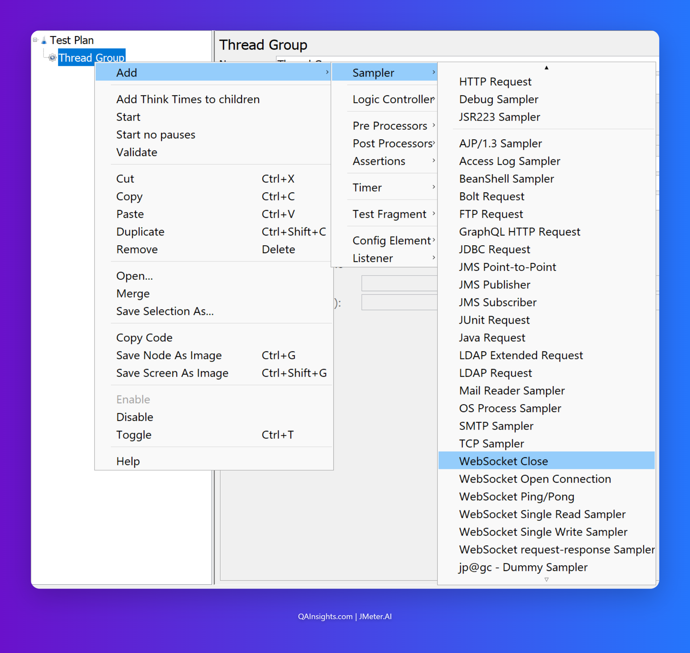
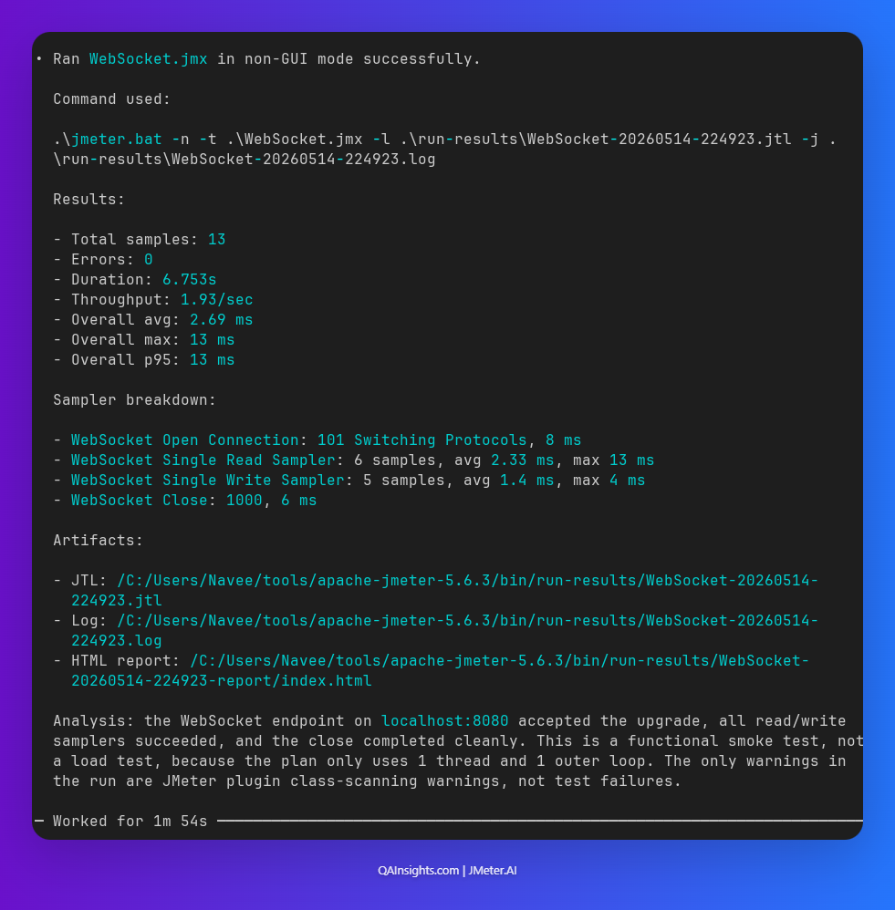

# JMeter WebSocket Plugin Tutorial: Testing Real-Time Apps Under Load

In this blog post, we will see how to load test a real-time WebSocket application using the JMeter WebSocket Samplers plugin by Peter Doornbosch. We will spin up a sample Node.js chat server, connect it to JMeter, and walk through every sampler you need to simulate realistic user behavior.

WebSocket testing is one of those areas that trips up even experienced performance engineers. HTTP samplers will not work here. You need a dedicated plugin, a clear understanding of the connection lifecycle, and a sample app you can actually run locally. Let us cover all three.

## What Makes WebSocket Testing Different?

With HTTP, every request opens a connection, gets a response, and closes. It is stateless by design. WebSocket is the opposite. A single persistent connection stays open and both the client and server can push messages at any time.

This means your JMeter test plan needs to model:

Opening the WebSocket handshake (HTTP Upgrade request)

Writing messages to the server

Reading messages from the server (including server-initiated pushes)

Closing the connection gracefully

A standard HTTP sampler cannot do any of this. You need the WebSocket Samplers plugin by Peter Doornbosch, which gives you individual samplers for each of these lifecycle steps.

---

## Sample App: Real-Time Chat Server (Node.js)

Before touching JMeter, you need something to test. Let us build a minimal WebSocket chat server in Node.js. Every connected client joins a room. When one client sends a message, the server broadcasts it to all connected clients.

### Prerequisites

- Node.js 18 or later
- npm

### Project Setup

Create a new directory and initialise the project.

```bash
mkdir ws-chat-server
cd ws-chat-server
npm init -y
npm install ws
```

### Server Code

Create a file named `server.js` with the following content.

```javascript
const WebSocket = require("ws");

const PORT = 8080;
const wss = new WebSocket.Server({ port: PORT });

let clientCount = 0;

wss.on("connection", (ws) => {
  clientCount++;
  const clientId = clientCount;
  console.log(`Client ${clientId} connected. Total: ${wss.clients.size}`);

  // Send a welcome message to the connecting client
  ws.send(
    JSON.stringify({
      type: "welcome",
      clientId: clientId,
      message: `Welcome! You are client #${clientId}`,
      timestamp: Date.now(),
    })
  );

  ws.on("message", (data) => {
    let parsed;
    try {
      parsed = JSON.parse(data);
    } catch {
      parsed = { message: data.toString() };
    }

    console.log(`Client ${clientId} sent: ${JSON.stringify(parsed)}`);

    // Broadcast to all connected clients including sender
    const broadcast = JSON.stringify({
      type: "chat",
      from: clientId,
      message: parsed.message,
      timestamp: Date.now(),
    });

    wss.clients.forEach((client) => {
      if (client.readyState === WebSocket.OPEN) {
        client.send(broadcast);
      }
    });
  });

  ws.on("close", () => {
    console.log(`Client ${clientId} disconnected. Total: ${wss.clients.size}`);
  });

  ws.on("error", (err) => {
    console.error(`Client ${clientId} error: ${err.message}`);
  });
});

console.log(`WebSocket chat server running on ws://localhost:${PORT}`);
``` 

### Start the Server

```bash
node server.js
```

You should see the output as shown below.
```
WebSocket chat server running on ws://localhost:8080
```

### Quick Manual Verification

Before running any load test, always verify the app manually. Open a browser console on any page and run:

```javascript
const ws = new WebSocket("ws://localhost:8080");
ws.onmessage = (e) => console.log("Received:", e.data);
ws.onopen = () => ws.send(JSON.stringify({ message: "Hello from browser" }));
```

You should see the welcome message and your broadcast echoed back. If this works, the server is ready for JMeter.

---

## Installing the WebSocket Samplers Plugin

Head to **Options > Plugins Manager** in JMeter. If you do not have the Plugins Manager installed, grab it from plugins.jmeter.ai.

In the Plugins Manager:

- Click the **Available Plugins** tab
- Search for **WebSocket**
- Select **WebSocket Samplers by Peter Doornbosch**

Click **Apply Changes** and **Restart JMeter**

After JMeter restarts, right-click any Thread Group or Sampler to confirm the new samplers appear in the **Add > Sampler** menu, as shown below.



---

## Understanding the Samplers

The plugin provides five samplers. Knowing when to use each one saves a lot of debugging time.

| Sampler | What It Does |
| :--- | :--- |
| **WebSocket Open Connection** | Performs the HTTP Upgrade handshake and establishes the WS connection |
| **WebSocket Single Write Sampler** | Sends a single text or binary frame to the server |
| **WebSocket Single Read Sampler** | Reads one frame from the server (blocking until it arrives or times out) |
| **WebSocket request-response Sampler** | Writes a frame and waits for exactly one response in a single sampler |
| **WebSocket Close** | Sends a Close frame and tears down the connection |

For our chat app use case, the connection lifecycle is:
```
Open Connection
  → Read welcome message    (server pushes first)
  → Write chat message
  → Read broadcast response
  → [repeat write/read loop]
Close Connection
```

---

## Building the JMeter Test Plan

Here is the complete test plan structure. Each step is explained below.

```
Test Plan
└── Thread Group (50 VUs, 60s ramp, 5 min duration)
    ├── WebSocket Open Connection
    ├── WebSocket Single Read Sampler       ← receive welcome
    ├── Constant Timer (1000ms)
    ├── Loop Controller (5 iterations)
    │   ├── WebSocket Single Write Sampler  ← send chat message
    │   ├── WebSocket Single Read Sampler   ← read broadcast
    │   └── Constant Timer (2000ms)
    └── WebSocket Close
```

### Step 1: Thread Group

Add a Thread Group under the Test Plan.

Number of Threads: 50
Ramp-Up Period: 60 seconds
Loop Count: Check "Specify Thread Lifetime"
Duration: 300 seconds
Startup Delay: 0

### Step 2: WebSocket Open Connection

Right-click the `Thread Group > Add > Sampler > WebSocket Open Connection`.

Configure as shown below:

- **Server name or IP**: `localhost`
- **Port**: `8080`
- **Path**: `/`
- **Protocol**: `ws` (or `wss` for secured connections)
- **Connection timeout**: `5000` ms
- **Read timeout**: `10000` ms

The sampler stores the connection in a named variable. By default, it uses a connection named `connection1`. Leave the connection name as is for now. 

All subsequent samplers in the same thread will reuse this connection automatically.

### Step 3: Read the Welcome Message

Add a WebSocket Single Read Sampler right after the Open Connection.

Use existing connection: checked
Connection name: `connection1`
Read timeout: `5000` ms

This sampler blocks until the server sends the welcome message. If no message arrives within the timeout, the sampler fails. That is a useful behaviour for asserting that your server acknowledges the connection properly.

### Step 4: Loop Controller

Add a Loop Controller and set the loop count to `5`. This simulates each virtual user sending 5 chat messages per session.

### Step 5: Write a Chat Message

Inside the Loop Controller, add a WebSocket Single Write Sampler.

Connection name: `connection1`
Message type: `Text`
Message payload:

```json
{"message": "Feather Wand - World's First JMeter Agent ${__threadNum} at ${__time(HH:mm:ss)}"}
```

Using `${__threadNum}` and `${__time()}` makes each message unique. This is important for asserting the correct broadcast is returned.

### Step 6: Read the Broadcast

Still inside the Loop Controller, add another WebSocket Single Read Sampler after the write.

Connection name: `connection1`
Read timeout: `5000` ms

This reads the broadcast that the server sends back to all clients after each message. Since all threads are connected, every thread will receive broadcasts from other threads too. 

The Read Sampler reads the next available frame on the connection, which may or may not be the response to your specific write. This is an important nuance covered in the gotchas section.

### Step 7: Close the Connection

Outside the Loop Controller, add a WebSocket Close sampler.

Connection name: `connection1`
Status code: `1000` (Normal Closure)

Always close the connection explicitly. Leaving it open causes the server to hold resources until it detects the client has gone away, which can skew your server-side metrics.

## Adding Assertions

Assertions on WebSocket responses work on the raw text frame content.

### Assert the Welcome Message

On the first WebSocket Single Read Sampler, add a Response Assertion.

Field to Test: Response Body
Pattern Matching Rules: Contains
Patterns to Test: `"type":"welcome"`

### Assert Broadcast Contains a Message

On the Read Sampler inside the loop, add a Response Assertion:

Field to Test: Response Body
Pattern Matching Rules: Contains
Patterns to Test: `"type":"chat"`

### Assert Read Sampler Responded at All

Add a Duration Assertion to any Read Sampler to catch timeouts that return empty:

Duration to Assert: 4000 ms

> Personal observation: I have seen teams skip WebSocket assertions completely because they assume that if the sampler passes, the content is valid. Do not do this. A timed-out Read Sampler can still return an empty response with a 200 status in some plugin versions. Always assert the body.

---

## Think Time and Connection Lifecycle

WebSocket tests without think time will hammer your server at wire speed. That is not realistic and it is not useful for capacity planning.

Add a Constant Timer in two places:

- After the Open Connection + Welcome Read: 1000ms. This models the brief delay before a user starts typing.
- After each Read Sampler inside the loop: 2000ms. This models think time between chat messages.

If you want a more realistic distribution, replace the Constant Timer with a Gaussian Random Timer (constant = 2000ms, deviation = 1000ms).

---

## Running the Load Test

Always run a single-user smoke test first. Set the Thread Group to 1 VU and check the **View Results Tree** listener.

Confirm:

- Open Connection returns a 101 Switching Protocols status
- The first Read Sampler body contains `"type":"welcome"`
- Write Sampler sends the payload successfully
- The Read Sampler inside the loop returns a broadcast with `"type":"chat"`
- WebSocket Close completes with status 1000

Once the smoke test passes, switch to non-GUI mode for the actual load run.

```bash
jmeter -n \ 
  -t ws-chat-test.jmx \
  -l results/results.jtl \
  -e -o results/dashboard \
  -Jthreads=50 \        
  -Jduration=60
```

---

## Analyzing Results

Open the HTML dashboard at `results/dashboard/index.html`.

Key metrics to watch for WebSocket tests:

| Metric | What to Look For |
| :--- | :--- |
| Response Time (Open Connection) | Should be low (< 100ms on localhost). Spikes indicate server connection queue pressure. |
| Response Time (Read Sampler) | This is your server processing + broadcast latency. Watch p95 and p99. |
| Error Rate | Read Sampler timeouts are the most common failure. They mean your server is not responding fast enough. |
| Throughput (TPS) | Write Sampler TPS = messages sent per second. Compare with what your app promises. |

Watch server-side metrics alongside JMeter results. The `ws` module in Node.js is single-threaded. Under high VU counts you may see CPU saturation before memory. Install PerfMon Server Agent on the target host and add a PerfMon Collector listener in JMeter for server-side CPU and memory correlation.

I used Feather Wand - World's First JMeter Agent to create and run this plan. It works great.



---

## Common Gotchas

### 1. Read Sampler picks up the wrong message

In a chat app, every connected client gets every broadcast. When 50 VUs are connected and all writing, a Read Sampler on one thread may receive a broadcast intended for another user's message. This is correct WebSocket behaviour, not a bug. If you need to validate that a specific response matches a specific request, use the [`WebSocket request-response Sampler`](https://jmeter-plugins.org/wiki/WebSocketRequestResponseSampler) instead of separate Write + Read pairs. It sends a frame and waits for a frame that matches a regex pattern.

### 2. Connection not reused across samplers

All samplers must use the same Connection Name. If you change the name in any one sampler, a new connection is opened. Check the connection name field on every sampler in your plan.

### 3. Secure WebSocket (wss://) with self-signed certificates

If your app uses `wss://`, JMeter will reject self-signed certificates by default. Add `-Djsse.enableSNIExtension=false` to your JVM arguments and import your certificate into the JMeter keystore, or pass `-Djavax.net.ssl.trustStore=your.jks` in `user.properties`.

### 4. Open Connection sampler showing 0ms

This can happen if JMeter is reusing a cached connection. Check that each thread opens its own connection and that you do not have a connection being shared across threads unintentionally.

### 5. Server not receiving close frames

Some WebSocket servers log client disconnects as errors when the close frame is missing. Always add the WebSocket Close sampler at the end of your Thread Group, not inside a loop.

---

## Wrapping Up

Testing WebSocket applications in JMeter is straightforward once you understand the connection lifecycle. The key is to model the Open, Write, Read, and Close steps explicitly rather than trying to wrap everything into a single sampler.

The sample Node.js chat server in this post gives you a real target to experiment with. Try ramping to 200 VUs and watching what happens to the broadcast latency. Then try replacing `wss.clients.forEach` with a proper message queue and see if the numbers improve.

Happy Testing!